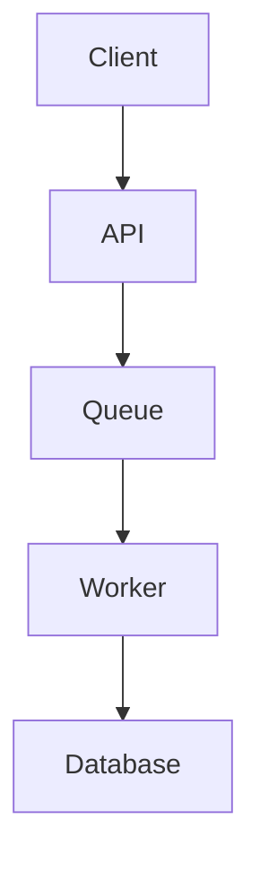

# PRD and Technical Spec Generator

## Purpose

Generate actionable Product Requirements Documents and technical specifications through a structured interview workflow. Ask targeted clarifying questions before writing to ensure completeness. Produce specs that engineering can start working from without follow-up meetings.

## When to Use

- User asks to write a PRD, product spec, or feature requirements
- User asks to create a technical specification or engineering brief
- User wants to document a new feature idea
- User needs to formalize requirements from a conversation or meeting notes
- User asks to validate or improve an existing PRD

## Design-First Gate

<HARD-GATE>
Do NOT write code, scaffold, or implement until the PRD/design is approved by the user.
This applies to EVERY feature regardless of perceived simplicity.
</HARD-GATE>

"Simple" projects are where unexamined assumptions cause the most wasted work. The PRD can be short (a few sentences for truly simple features), but you MUST present it and get approval.

## Examples

**Example 1: New feature PRD**
```
User: "Write a PRD for adding CSV export to our dashboard"
Claude: [Uses prd-generator] Before drafting, let me ask a few targeted questions:

1. Who is the primary user? (internal analysts, external clients, both?)
2. What data needs to be exportable? (all dashboard data, specific views, filtered results?)
3. What's the trigger for building this now?
4. Scope: S (days), M (weeks), or L (months)?
5. How do we measure success? (adoption rate, support ticket reduction?)
6. Any known constraints? (file size limits, PII handling, rate limiting?)

[After answers, generates full PRD with problem statement, user stories,
acceptance criteria, success metrics, and open questions]
```

**Example 2: Technical spec from PRD**
```
User: "Turn this PRD into a technical spec for the engineering team"
Claude: [Uses prd-generator] I'll translate requirements into implementation:

# Technical Specification: CSV Export

## Architecture Overview
[Mermaid diagram of data flow]

## API Contract
POST /api/v1/exports
Request: { filters, format, columns }
Response: { exportId, status, downloadUrl }

## Implementation Plan
1. Create export queue service
2. Implement CSV serialization
3. Add download endpoint with signed URLs
...
```

**Example 3: Spec validation**
```
User: "Review this PRD and tell me what's missing"
Claude: [Uses prd-generator] Running validation checklist:

Ambiguity Check: FAIL - "fast response time" needs a specific metric (e.g., <200ms)
Completeness: WARN - No error states defined for the upload flow
Testability: PASS - All acceptance criteria are binary yes/no
Dependencies: FAIL - Missing reference to auth service dependency

Recommendations:
1. Replace "fast" with "<200ms p95 latency"
2. Add acceptance criteria for error handling
3. Document auth service dependency and fallback behavior
```

## Interview Workflow

Always run the clarifying interview before generating a PRD.

### Interview Style

- Ask questions **one at a time** (not all at once)
- Prefer multiple-choice options when possible
- Focus on understanding: purpose, constraints, success criteria
- Only one question per message — if a topic needs more exploration, break it into multiple questions

**Quick Mode (S-scope):** For small features (S-scope, days of work), present all 6 core questions in a single message instead of one-at-a-time. This gets from idea to spec in under 5 minutes. Target: PRD should be under 2 pages.

### Core Questions (Always Ask)

```
PRD Interview:

1. What? One-sentence feature description:
2. Who? Primary user persona (or "internal team"):
3. Why now? What triggered this / what's the urgency?
4. Scope: S (days), M (weeks), or L (months)?
5. Success metric? How do we know it worked?
6. Blockers? Any known dependencies or constraints?
```

### Deep Questions (Ask for M/L Scope)

```
7. What's the cost of NOT solving this?
8. If we had half the time, what would we cut?
9. Are there existing tickets, docs, or prior art?
10. Who are the stakeholders who need to sign off?
11. What's explicitly OUT of scope?
12. Any regulatory or compliance considerations?
```

For crypto/fintech features, also ask:
- Does this touch on-chain data or token economics?
- Are there regulatory implications (KYC/AML, SEC)?
- Does this affect market data accuracy or latency?

## Approach Exploration

After the interview, before writing the PRD:

1. **Propose 2-3 different approaches** with trade-offs for each
2. **Lead with your recommended option** and explain why
3. **Get user approval** on approach before proceeding to the full PRD

This prevents wasted effort on specs that solve the wrong problem or use the wrong architecture.

## PRD Template

Generate PRDs with these sections. Adapt depth to scope (S = lighter, L = comprehensive):

```markdown
# [Feature Name] PRD

**Status:** Draft | **Owner:** [User] | **Created:** [Date] | **Scope:** S/M/L

## TL;DR
[2-3 sentences maximum. What are we building and why.]

## Problem Statement
- **Context:** [Why this feature is needed now]
- **User Pain Point:** [Specific friction being addressed]
- **Cost of Inaction:** [What happens if we do nothing]

## Solution Overview
- Core functionality (bullet points)
- What is explicitly OUT of scope

## User Stories
- [ ] As a [persona], I want [action] so that [outcome]
- [ ] As a [persona], I want [action] so that [outcome]

## Acceptance Criteria
- [ ] [Testable criterion - must be yes/no answerable]
- [ ] [Testable criterion]
- [ ] [Testable criterion]

## Non-Functional Requirements
- **Performance:** [Specific metric, e.g., API response <200ms p95]
- **Security:** [Auth requirements, data handling]
- **Scalability:** [Expected load, growth projections]

## Success Metrics
| Metric | Current | Target | Timeframe |
|--------|---------|--------|-----------|
| [KPI]  | [Baseline] | [Goal] | [When]  |

## Technical Notes
[3 bullets max. Dependencies, API changes, infra needs.]

## Assumptions and Constraints
- [Assumption 1]
- [Constraint 1]

## Open Questions
- [ ] [Unresolved question 1]
- [ ] [Unresolved question 2]

## Timeline
- **Phase 1 (MVP):** [What ships first]
- **Phase 2:** [Follow-on work]
```

## Technical Spec Template

Generate after PRD is approved. Translates "what" into "how":

```markdown
# Technical Specification: [Feature Name]

**PRD Reference:** [Link to PRD]
**Author:** [Engineer] | **Reviewed by:** [Reviewer]

## Architecture Overview
[Description of system components and their interactions]



## API Contract
**Endpoint:** `POST /api/v1/resource`
**Auth:** Bearer token (JWT)

**Request:**
```json
{
  "field": "string",
  "options": { "key": "value" }
}
```

**Response (200):**
```json
{
  "id": "uuid",
  "status": "created",
  "createdAt": "ISO8601"
}
```

**Error Responses:**
| Code | Meaning | Body |
|------|---------|------|
| 400 | Validation error | `{ "errors": [...] }` |
| 401 | Unauthorized | `{ "message": "..." }` |
| 429 | Rate limited | `{ "retryAfter": seconds }` |

## Database Schema
[Table definitions, indexes, migration plan]

## Implementation Plan
- [ ] Step 1: [Task with file references]
- [ ] Step 2: [Task]
- [ ] Step 3: [Task]

## Test Plan
- Unit tests for [component]
- Integration tests for [API endpoints]
- E2E test for [user flow]
```

For complete PRD and tech spec templates with crypto/fintech variants, see `references/templates.md`.

## Spec Validation Checklist

Run before sharing any spec:

- **Ambiguity check:** Are there vague terms ("fast", "secure", "scalable") without metrics?
- **Completeness:** Are all acceptance criteria defined? Are error states covered?
- **Testability:** Can QA write test cases from the acceptance criteria alone?
- **Scope clarity:** Is there exactly ONE way to interpret "done"?
- **Dependency mapping:** Are all external services and team dependencies listed?
- **Metric validity:** Can success metrics be queried from an existing dashboard?
- **Handoff readiness:** Would you send this to engineering without a meeting?

### Section-by-Section Approval

For M/L scope PRDs, present each major section to the user for approval before moving on:
- Scale detail to complexity: a few sentences for simple sections, up to 300 words for complex ones
- Be ready to revise if something doesn't align with user expectations
- Don't proceed to the next section until the current one is approved

## Multi-Perspective Validation

For M/L scope PRDs, validate from three perspectives:

1. **Engineer lens:** Check technical feasibility, missing edge cases, complexity estimate
2. **Executive lens:** Check business value alignment, ROI justification, strategic fit
3. **User lens:** Check usability assumptions, persona accuracy, journey completeness

## Spec-Driven Development

After spec approval, use it to drive implementation:

1. **Test-first:** Generate test suite from acceptance criteria before writing code
2. **Plan mode:** Feed the tech spec to Claude Code and ask for a step-by-step execution plan
3. **Ticket generation:** Decompose the spec into Jira tickets with the jira-automation skill
4. **Persistent context:** Reference specs in CLAUDE.md so Claude always checks them before proposing code changes

## Success Criteria

- [ ] PRD can be understood without a walkthrough meeting
- [ ] All acceptance criteria are testable (yes/no answers)
- [ ] Success metrics are measurable with existing tools
- [ ] Scope is unambiguous (what's in AND what's out)
- [ ] Technical spec includes API contracts and schema changes
- [ ] Open questions section captures all unresolved items
- [ ] Document is under 2 pages for S scope, under 5 for L scope

## Copy/Paste Ready

```
"Write a PRD for [feature name]"
"Create a technical spec from this PRD"
"Review this PRD and find gaps"
"Generate acceptance criteria for [feature]"
"Turn these meeting notes into a product spec"
```
