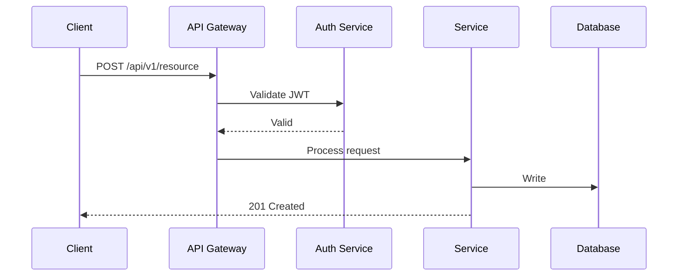
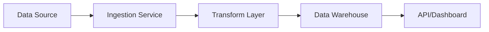

# PRD and Tech Spec Templates Reference

## Table of Contents

- Crypto/Fintech PRD Variant
- Lightweight PRD (S-scope)
- Technical Spec - API Feature
- Technical Spec - Data Pipeline
- Non-Functional Requirements Catalog
- Acceptance Criteria Patterns

## Crypto/Fintech PRD Variant

Use this variant when the feature touches on-chain data, token economics, market data, or regulatory requirements.

```markdown
# [Feature Name] PRD - Crypto/Fintech

**Status:** Draft | **Owner:** [Name] | **Scope:** M

## TL;DR
[What we're building and why, in crypto context]

## Problem Statement
- **Market Context:** [Current market conditions affecting this feature]
- **User Pain Point:** [Specific friction for crypto users/analysts]
- **Competitive Gap:** [What competitors offer that we don't]

## Solution Overview
- Core functionality
- Out of scope

## User Stories
- [ ] As a crypto analyst, I want [action] so that [outcome]
- [ ] As a data subscriber, I want [action] so that [outcome]

## Acceptance Criteria
- [ ] [Criterion]

## Data Requirements
- **On-chain data sources:** [Chains, protocols, contract addresses]
- **Off-chain data sources:** [APIs, databases, feeds]
- **Refresh frequency:** [Real-time, hourly, daily]
- **Historical depth:** [How far back]

## Regulatory Considerations
- **KYC/AML impact:** [Does this feature change user data collection?]
- **Jurisdictional limits:** [Geographic restrictions]
- **Data privacy:** [GDPR, CCPA implications for on-chain data]

## Success Metrics
| Metric | Current | Target | Timeframe |
|--------|---------|--------|-----------|
| [KPI]  | [Baseline] | [Goal] | [When]  |

## Market Risk
- [How market volatility could affect this feature]
- [Dependencies on specific protocols or chains]

## Technical Notes
- [Blockchain RPC endpoints needed]
- [Indexer or subgraph requirements]

## Open Questions
- [ ] [Question]
```

## Lightweight PRD (S-scope)

For features that can ship in days. Skip sections that add friction without value.

```markdown
# [Feature Name] - Quick Spec

**Owner:** [Name] | **Target:** [Date] | **Scope:** S

## What
[2-3 sentences describing the change]

## Why Now
[1 sentence on urgency/trigger]

## Acceptance Criteria
- [ ] [Criterion 1]
- [ ] [Criterion 2]
- [ ] [Criterion 3]

## Out of Scope
- [What we're NOT doing]

## Success Metric
[Single measurable outcome]
```

## Technical Spec - API Feature

```markdown
# Technical Specification: [API Feature Name]

**PRD:** [Link] | **Author:** [Name]

## Architecture



## Endpoints

### POST /api/v1/[resource]

**Auth:** Bearer token (JWT)
**Rate Limit:** 100 req/min per user

**Request:**
```json
{
  "name": "string (required, 1-255 chars)",
  "type": "enum: basic | premium | enterprise",
  "metadata": {
    "key": "string (optional)"
  }
}
```

**Response (201 Created):**
```json
{
  "id": "uuid",
  "name": "string",
  "type": "string",
  "createdAt": "2026-01-15T10:30:00Z",
  "updatedAt": "2026-01-15T10:30:00Z"
}
```

**Error Responses:**

| Status | Code | Description |
|--------|------|-------------|
| 400 | VALIDATION_ERROR | Invalid request body |
| 401 | UNAUTHORIZED | Missing or invalid token |
| 403 | FORBIDDEN | Insufficient permissions |
| 409 | CONFLICT | Resource already exists |
| 429 | RATE_LIMITED | Too many requests |

### GET /api/v1/[resource]/:id

**Auth:** Bearer token
**Cache:** 5 min TTL

**Response (200):**
```json
{
  "id": "uuid",
  "name": "string",
  "type": "string",
  "createdAt": "ISO8601",
  "updatedAt": "ISO8601"
}
```

## Database Schema

```sql
CREATE TABLE resources (
  id UUID PRIMARY KEY DEFAULT gen_random_uuid(),
  name VARCHAR(255) NOT NULL,
  type VARCHAR(50) NOT NULL CHECK (type IN ('basic', 'premium', 'enterprise')),
  metadata JSONB DEFAULT '{}',
  created_at TIMESTAMPTZ DEFAULT NOW(),
  updated_at TIMESTAMPTZ DEFAULT NOW(),
  created_by UUID REFERENCES users(id)
);

CREATE INDEX idx_resources_type ON resources(type);
CREATE INDEX idx_resources_created_by ON resources(created_by);
```

## Implementation Steps
- [ ] Create database migration
- [ ] Implement service layer with validation
- [ ] Add API routes with auth middleware
- [ ] Write unit tests for service layer
- [ ] Write integration tests for API endpoints
- [ ] Update API documentation
```

## Technical Spec - Data Pipeline

```markdown
# Technical Specification: [Pipeline Name]

## Pipeline Architecture



## Data Flow

| Stage | Tool | Input | Output | SLA |
|-------|------|-------|--------|-----|
| Ingest | Python/Airbyte | Raw API data | JSON files | <5 min |
| Transform | dbt/Python | JSON files | Clean tables | <15 min |
| Serve | Supabase/API | Clean tables | API responses | <200ms |

## Schema

**Source table:** [raw data schema]
**Target table:** [clean data schema]
**Refresh:** [Frequency and trigger]

## Error Handling
- Retry: 3 attempts with exponential backoff
- Dead letter: Failed records go to [error table/queue]
- Alerting: Slack notification on pipeline failure
```

## Non-Functional Requirements Catalog

Reference this when writing the NFR section of any PRD:

| Category | Metric | Typical Target | How to Measure |
|----------|--------|---------------|----------------|
| Performance | API response time | <200ms p95 | APM tool (Datadog, New Relic) |
| Performance | Page load time | <2s | Lighthouse, Web Vitals |
| Availability | Uptime | 99.9% | Status page monitoring |
| Scalability | Concurrent users | [Define based on expected load] | Load testing (k6, Artillery) |
| Security | Auth method | JWT with refresh tokens | Security audit |
| Security | Data encryption | AES-256 at rest, TLS 1.3 in transit | Infrastructure config |
| Compliance | Data retention | [Per policy/regulation] | Automated purge jobs |
| Accessibility | WCAG level | AA | axe-core, manual audit |

## Acceptance Criteria Patterns

Write acceptance criteria that are binary (yes/no testable):

**Good patterns:**
- "Given [context], when [action], then [specific result]" (Gherkin)
- "User can [action] and sees [specific UI element]"
- "[Metric] is below [threshold] under [conditions]"

**Bad patterns (avoid):**
- "System is fast" (how fast?)
- "UI is intuitive" (for whom?)
- "Handles errors gracefully" (what errors? what response?)

**Examples:**
```
GOOD: "API returns 200 with valid JSON within 200ms for 95% of requests"
BAD:  "API responds quickly"

GOOD: "User sees error toast with message when upload exceeds 10MB"
BAD:  "System handles large files"

GOOD: "Dashboard loads with cached data in <1s, live data in <3s"
BAD:  "Dashboard is responsive"
```
