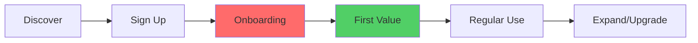

# User Research Synthesis

## Purpose

Transform raw qualitative data (interview transcripts, survey responses, feedback logs) into structured product insights. Extract themes, create data-driven personas, map user journeys, and generate research reports that connect to actionable product decisions. Enable a PM who is not a trained researcher to perform rigorous synthesis.

## When to Use

- User asks to analyze interview transcripts or survey responses
- User wants to extract themes from qualitative feedback
- User needs to create user personas from research data
- User asks to map a user journey from research findings
- User wants to synthesize feedback into a research report
- User needs to turn research insights into product requirements

## Examples

**Example 1: Interview transcript analysis**
```
User: "Analyze these 5 interview transcripts and find common themes"
Claude: [Uses research-synthesis] Processing transcripts...

Theme Analysis (5 interviews):

| Theme | Frequency | Severity | Key Quote |
|-------|-----------|----------|-----------|
| Onboarding confusion | 4/5 | High | "I had no idea where to start" |
| Slow dashboard load | 3/5 | Medium | "I grab coffee while it loads" |
| Missing export | 3/5 | Medium | "I screenshot the table every week" |
| Love the alerts | 5/5 | Positive | "The Slack notifications are a lifesaver" |

Top Recommendation: Simplify onboarding flow (4/5 users struggled)
Bright Spot: Alert system is working well, expand it
```

**Example 2: Persona creation**
```
User: "Create a user persona from our research data"
Claude: [Uses research-synthesis]

# Persona: Data-Hungry Analyst

**Demographics:** Mid-career crypto analyst, 3-5 years experience
**Company size:** 50-200 employees
**Tools:** Excel, Looker, Python (basic)

**Goals:**
- Get market data faster than competitors
- Create client-ready reports in <30 minutes
- Track portfolio performance across chains

**Pain Points:**
- Spends 2hrs/day aggregating data from 4+ sources
- Manual CSV exports are error-prone
- Dashboard doesn't show cross-chain view

**Behavior Patterns:**
- Checks data first thing in the morning (6-7am)
- Exports data weekly for client reports
- Uses mobile for quick checks, desktop for deep analysis

**Jobs to Be Done:**
"When I need to prepare a client report, I want consolidated
cross-chain data so I can deliver insights before the market moves."
```

**Example 3: Research to requirements**
```
User: "Turn these research findings into product requirements"
Claude: [Uses research-synthesis]

Research Finding -> Requirement Mapping:

| Finding | Evidence | Requirement | Priority |
|---------|----------|-------------|----------|
| 4/5 users confused by onboarding | Interviews + support tickets | Guided onboarding wizard | P0 |
| 3/5 want CSV export | Interviews + 15 feature requests | Dashboard export button | P1 |
| Users check data at 6am | Usage analytics + interviews | Mobile-optimized dashboard | P1 |

[Generates PRD-ready user stories for each requirement]
```

## Research Database Setup

Organize raw research data in a structured folder:

```
research/
  interviews/
    participant-01.md
    participant-02.md
    ...
  surveys/
    q4-satisfaction.csv
    onboarding-feedback.csv
  analytics/
    usage-data.csv
    funnel-metrics.csv
  synthesis/
    themes.md          (generated output)
    personas.md        (generated output)
    journey-map.md     (generated output)
```

Point Claude to specific folders for focused analysis. Claude can explore the directory structure and cross-reference across data types.

## Interview Transcript Analysis

### Step 1: Ingest and Tag

For each transcript, extract structured data:

```markdown
## Participant: [ID]
**Role:** [Job title]
**Segment:** [User type]
**Date:** [Interview date]

### Key Quotes
- "[Direct quote]" - Context: [What they were discussing]
- "[Direct quote]" - Context: [What they were discussing]

### Pain Points Identified
1. [Pain point with severity: High/Medium/Low]
2. [Pain point]

### Positive Moments
1. [What they liked]

### Jobs to Be Done
- "When I [situation], I want to [motivation] so I can [outcome]"
```

### Step 2: Cross-Transcript Theme Extraction

After processing all transcripts, cluster into themes:

```markdown
## Theme: [Theme Name]
**Frequency:** [N out of M participants]
**Severity:** [High/Medium/Low based on impact described]

### Evidence
- Participant 01: "[Quote]"
- Participant 03: "[Quote]"
- Participant 05: "[Quote]"

### Insight
[What this pattern means for the product]

### Recommended Action
[Specific product change this suggests]
```

### Step 3: Jobs-to-Be-Done Extraction

Use the JTBD framework to extract actionable job statements:

For each significant moment in transcripts, identify:

| Factor | Description | Example |
|--------|-------------|---------|
| **Job Statement** | Functional goal | "Monitor token prices across chains" |
| **Push Forces** | Pain with current solution | "Current tool requires manual refresh" |
| **Pull Forces** | Attraction to new solution | "Real-time alerts would save 30 min/day" |
| **Anxiety** | Fear about switching | "Will I lose my historical data?" |
| **Habit** | Attachment to current way | "I've used spreadsheets for 3 years" |

## Persona Creation

### Data-Driven Process

1. **Cluster users** by behavior patterns (not demographics)
2. **Identify 3-5 distinct segments** from the data
3. **Select the primary persona** based on business goal alignment
4. **Ground every attribute** in actual research data

### Persona Template

```markdown
# Persona: [Name]

## Demographics
- **Role:** [Job title]
- **Experience:** [Level]
- **Industry:** [Sector]
- **Team size:** [Number]

## Goals
- [Primary goal - from interview data]
- [Secondary goal]
- [Tertiary goal]

## Pain Points
- [Pain 1] (Source: [N] interviews, [M] support tickets)
- [Pain 2] (Source: [evidence])
- [Pain 3] (Source: [evidence])

## Behavior Patterns
- [When they use the product]
- [How they use it]
- [Workarounds they've built]

## Jobs to Be Done
"When I [situation], I want to [motivation] so I can [outcome]."

## Quotes
- "[Actual quote from research]" - Participant [ID]
- "[Actual quote]" - Participant [ID]

## Anti-Goals (What They Do NOT Want)
- [Explicit thing they want to avoid]
```

### Validation Rule

Every persona attribute must trace back to research data. If information is missing from the research, state "Insufficient data" rather than fabricating attributes.

## User Journey Mapping

### Journey Map Template

```markdown
# User Journey: [Journey Name]

## Persona: [Persona Name]
## Scenario: [Specific scenario being mapped]

| Stage | Action | Thinking | Feeling | Pain Points | Opportunities |
|-------|--------|---------|---------|-------------|---------------|
| Awareness | [What they do] | [What they think] | [Emotion] | [Friction] | [Product opportunity] |
| Consideration | [Action] | [Thought] | [Emotion] | [Friction] | [Opportunity] |
| Onboarding | [Action] | [Thought] | [Emotion] | [Friction] | [Opportunity] |
| First Value | [Action] | [Thought] | [Emotion] | [Friction] | [Opportunity] |
| Habitual Use | [Action] | [Thought] | [Emotion] | [Friction] | [Opportunity] |
| Expansion | [Action] | [Thought] | [Emotion] | [Friction] | [Opportunity] |
```

### Visual Journey Map

Generate a Mermaid diagram for visual presentation:



Color-code by sentiment: red = pain, green = delight, yellow = neutral.

## Research Report Template

```markdown
# Research Report: [Study Name]
**Date:** [Date] | **Researcher:** [Name] | **Method:** [Interviews/Survey/Mixed]

## Executive Summary
[3-4 sentences: what we learned and what to do about it]

## Methodology
- **Participants:** [N] [type] from [segments]
- **Method:** [Semi-structured interviews / Survey / Usability test]
- **Duration:** [Date range]

## Key Findings

### Finding 1: [Title]
**Severity:** [High/Medium/Low]
**Evidence:** [N/M participants, supporting data]
[Description and supporting quotes]

### Finding 2: [Title]
[Same structure]

## Themes

| Theme | Frequency | Severity | Action |
|-------|-----------|----------|--------|
| [Theme] | [N/M] | [H/M/L] | [Recommended action] |

## Personas (Updated)
[Reference to persona documents]

## Recommendations
1. **[Recommendation]** - Based on Finding [N], [expected impact]
2. **[Recommendation]** - Based on Finding [N], [expected impact]

## Next Steps
- [ ] [Action item with owner and date]
- [ ] [Action item]

## Appendix
- Raw transcript summaries
- Survey response data
- Methodology details
```

## Research to Product Decisions

### Bridge the Gap

Connect insights to engineering tickets:

1. **Synthesis:** Extract themes from raw data
2. **Prioritize findings** by frequency and severity
3. **Generate requirements:** Turn findings into user stories
4. **Create tickets:** Use jira-automation skill to push to Jira
5. **Track impact:** Define metrics to validate the research-backed decision

### Socratic Questions for Decision-Making

Before converting research into requirements, answer:

- What specific user pain point does this solve?
- What's the cost of NOT solving this?
- Do we have sufficient evidence (not just 1 interview)?
- Is this a must-have, should-have, or could-have?
- How will we measure whether the solution worked?

## Feedback Analysis Workflow

For ongoing customer feedback (support tickets, NPS responses, feature requests):

1. **Collect:** Aggregate feedback into a single folder or CSV
2. **Cluster:** Group by theme (Claude can auto-cluster from raw text)
3. **Score severity:** Rate each cluster by frequency x impact
4. **Trend:** Compare to previous period's clusters
5. **Report:** Generate monthly "Voice of Customer" summary

## Success Criteria

- [ ] Themes are grounded in evidence (quotes, frequency counts)
- [ ] Personas trace every attribute to actual research data
- [ ] Journey maps identify specific pain points with product opportunities
- [ ] Research report includes actionable recommendations
- [ ] Findings connect to measurable product requirements
- [ ] No fabricated or hallucinated user data

## Copy/Paste Ready

```
"Analyze these interview transcripts and extract themes"
"Create a user persona from our research data"
"Synthesize this customer feedback into a research report"
"Map the user journey for our onboarding flow"
"Turn these research findings into product requirements"
"Generate a Voice of Customer summary from this month's feedback"
```
