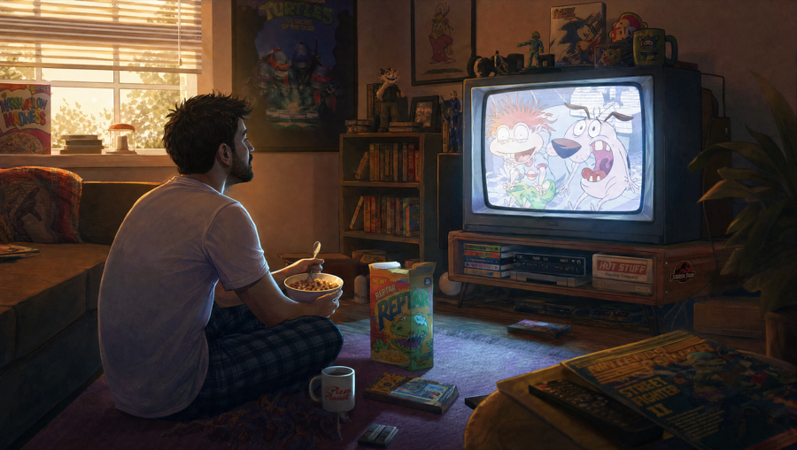
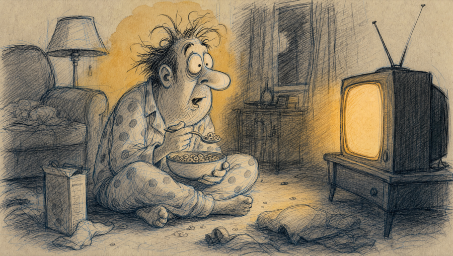

# Worked example: six generations, one afternoon

## Read this first

**This file is provenance, not material.** It exists so a reader can see that the interview
produces something before they spend an hour on one. It is one person's finished taste, told as a
story, which makes it the single most contaminating thing in this skill.

During an interview: never show this file to a user, never quote the reactions or the block back at
them, never offer any of it as an option, and never treat the shape of this run as the shape theirs
should take. Same hard guard as the calibration examples in `block-schema.md`, for the same reason.
If a user's answer is thin, ask again. Their run should look nothing like this one.

This is also not a template. The rounds below aren't a recommended sequence. They're what a person
who didn't yet know what he wanted actually did, which is the whole point.

---

## The run

One real run by the repo owner, 2026-08-09, GPT Image 2 at 16:9. Same scene held constant the whole
way: a man on the living room floor with a bowl of cereal, lit by an old TV playing Saturday morning
cartoons. Six generations total. Five of them were him finding out what he wanted.

## Before: the cold ask

The prompt anybody writes first.

```
Make me a warm, nostalgic illustration of a grown man watching Saturday morning cartoons.
A man sitting on the living room floor with a bowl of cereal, lit by the glow of the TV,
early morning. Make it cozy, beautiful, and professional.
```



> It felt too human and less animation. Like it was rotoscoped. Not terrible, but not what I wanted.

Note what that reaction is and isn't. It's a real objection, and it's useless as an instruction. He
knows it's wrong. He can't yet say what right is.

## The four rounds in between

**Prompt harder.** "More vibrant, more detail, really make it pop." The move everyone reaches for
second. Verdict: *"It's just a saturated version of the original."* Louder is not different.

**Kill the finish.** He named the actual complaint this time. It looks like an ad, show me the
pencil underneath, leave it unfinished. Closer, still wrong: *"It's still rotoscoped animation. Just
the a-Ha 'Take On Me' music video version."*

**Stop being nice.** Push the guy way further, make him a real cartoon, ugly is fine. This was the
first surprise: *"Now we're getting somewhere. THIS ONE surprised me. This is the weird interesting
drawing that I would create in my math notebook in high school. Just a little too gross and
disturbing for what I'm going for. It also needs a splash of color."* A want he couldn't have named
in round one showed up the second he saw it violated.

**One decision.** Strip the room, one thing to look at. Which produced both a step forward and the
realization the whole skill is built on:

> Definitely getting there. We have that splash of color, but now it's just a horror animation. I
> like silly and exaggerated. Not disgusting and horrifying. You know what? I should tell the model
> that instead of having it guess. Going through this process made me realize I didn't even know
> what I wanted in the first place.

That's the failure mode Wince exists to fix. Not bad prompting. Not knowing yet.

## After: the block, cold

Fresh thread. No reference image, no history, nothing carried over. Just a filled taste block and
the same scene, given exactly the starting conditions the cold ask got.



> THERE WE GO! Silly, goofy, old school animation that feels hand made. The splash of watercolor to
> bring it to life.

The block isn't reproduced here on purpose. It's one man's taste, and reading it would steer yours.
What it contains is the schema in `block-schema.md`, filled in with his own words: substrate, mark
making, one color rule, the show-the-work tell, register, the one move that carries meaning, and a
never-do list.

## What it cost

Six generations and most of an afternoon to arrive at a block that then worked cold, first try, in a
thread that knew nothing. That number is why this skill has a generation budget at all. The
afternoon isn't waste, it's how the taste got found. But you should only have to spend it once.

---

## Full capture

**In this repo only.** The complete round-by-round record, including every prompt verbatim, the
reactions in full, and two findings about content-filter refusals, lives at
`vault/20_projects/substack-studio/rung-0-taste-experiment/capture/prompts.md`.

That path is **not present in an exported or installed copy of this skill**. The installer copies
this skill directory and nothing else. If you installed Wince, the before and after above are the
whole record, and they're meant to be enough.
