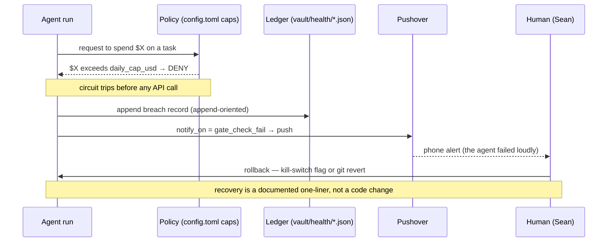

# Control Architecture: Authority, Recovery, Audit

> Controls for letting a small autonomous fleet spend real money against real credentials.

This document reframes infrastructure I already run — budget caps, circuit breakers, keychain-gated credentials, Pushover escalation, and append-oriented JSONL ledgers — as the three control surfaces Nate Jones names as the table stakes for production agent deployments: **Authority, Recovery, Audit** (§3.7, "implementation-architecture components"). None of this is new code. The Gemini Deep Research routes have run under a $50/month aggregate cap since April (other paid routes carry their own per-task caps; see §1). What was missing was the *name*. Calling it "cost discipline" undersold it: it is the same set of control *questions* an enterprise asks a Forward-Deployed Engineer to answer for a customer's agents, worked at single-laptop scale. The implementation is deliberately minimal and is presented as a concrete starting point, not a production reference architecture.

The fleet under discussion: 17 SDK agents on launchd schedules plus 13 Claude Code subagents, running headless overnight, authenticated against paid APIs (Anthropic, Gemini Deep Research) and free local models. The honest version of "autonomous agents with budgets" is that the interesting engineering is not the autonomy. It is the three things that keep the autonomy from quietly bankrupting you or silently producing nothing.

## The control loop, end to end



Four control surfaces fire in sequence on a single budget breach: the policy blocks, the ledger records, the human is paged, and a rollback path is already written down. The rest of this document is what each surface is, and where the real code lives.

## 1. Authority — who is allowed to spend what, and hold which key

Authority is the set of questions answered *before* an agent acts: how much may it spend, which credentials may it hold, and which models it is forbidden from using for a given task.

**Budget caps as policy, cascading.** Spend authority is declared in [`agents-sdk/config.toml`](../config.toml), not buried in code. Every task profile carries a per-query ceiling (`[safety] max_budget_default = 0.50` is the floor; individual agents raise or lower it — the daily-driver morning run gets `max_budget_usd = 0.90`, the skill-optimizer a hard `cost_cap_usd_hard = 200.00` over a soft `cost_cap_usd_soft = 50.00`). Above those sit the aggregate governors in `[gemini.budget]`: `daily_cap_usd = 20.00` and `monthly_cap_usd = 50.00`. Those aggregate governors cover the metered Gemini Deep Research routes specifically; a per-agent ceiling like the skill-optimizer's $200 is a separate task-level domain, not rolled into the $50 figure. The three tiers are deliberate. A per-query cap stops one runaway call; the daily cap catches the second-order case where ten individually-legal calls compound past the day's budget; the monthly governor is the backstop when a schedule misfires for a week. Authority is layered because a single threshold only catches a single failure mode.

**Keychain-gated credentials.** No long-lived secret is stored in a source-controlled file. Every API key is fetched at runtime from the macOS Keychain through [`agents-sdk/lib/keychain.py`](../lib/keychain.py), under the service prefix `com.sean.agents`; the module's own docstring is blunt about it — *"No .env files — this is the only sanctioned credential path."* This centralizes credential access through one runtime chokepoint — the place where an agent-to-credential policy *would* be enforced. In this single-user setup it does not by itself enforce per-agent scoping (every agent runs as the same user and calls the same helper), so the boundary it provides is "secrets out of the repo," not "per-agent identity." The same helper gates the Pushover tokens the escalation surface depends on, so a credential misconfiguration is caught at one place.

**Authority includes the power to forbid.** The Job Feed agent sets `fallback_disabled = true` ([`config.toml`](../config.toml), `[agents.job_feed]`): when its preferred local model is unreachable, it is *not* permitted to fall back to a paid API. It takes the miss. The policy is "this task is never worth paid spend" — the cheapest control in the system, and the one that has saved the most money.

**One note on routing.** A local-cloud router selects which model serves each task — authority over which brain runs which task, and nothing more. It is roughly a hundred lines of routing logic; framing it as an "agent operating system" or "runtime architecture" would invite concurrency and distributed-caching questions the code does not try to answer. That restraint is a deliberate, standing decision, not an omission.

## 2. Recovery — what happens when a control trips

Authority decides what is allowed. Recovery decides what happens at the boundary: how the system fails, and how a human puts it back.

**Documented exit-code semantics.** The fleet's hooks speak a small, fixed vocabulary, anchored in [`CLAUDE.md`](../../CLAUDE.md) ("Hook Exit Codes"): `0` allows, `1` logs an error but allows the operation, `2` denies and blocks. Exit `2` is the hard stop — a PreToolUse hook returning `2` is how a binary "no" is enforced without a model in the loop. The discipline is that the codes are *documented and stable*, so a failing gate is legible rather than a mystery crash.

**Circuit breakers that refuse to spend.** The cost-safety case is handled by a real exception, `RouteUnavailable`, in [`agents-sdk/lib/hybrid_router.py`](../lib/hybrid_router.py) (L41). When a route opts out of fallback (`fallback = "none"`) and its machine is offline, the router *raises before any paid API call or wake-on-LAN attempt* — no cross-tier scan, no silent spend. The inline contract says it plainly: *"no WoL, no API spend."* Failing closed, toward $0, is the recovery default.

**Escalation that fails loud.** When a gate trips or an agent errors, the human is paged through [`agents-sdk/lib/pushover.py`](../lib/pushover.py), governed by `[notifications] notify_on = ["agent_error", "gate_check_fail"]`. The module is built to fail loud on purpose: `ensure_credentials_or_raise()` crashes a run at boot if the Pushover keys are missing, rather than discovering at notify-time that the system whose job is surfacing failures cannot surface anything. A monitoring layer that can fail silently is worse than none.

**Rollback as a one-liner.** Every consumer-facing capability has a written rollback that is a flag flip, not a refactor. `[knowledge_index] inject_on_session_start = false` instantly stops the session-start context injection; `[artifacts] enabled = false` is a global kill-switch for the operating-model wiring. These are documented in [`config.toml`](../config.toml) beside the features they govern, so recovery is a known move under pressure, not an improvisation. (Config changes take effect on the next scheduled run; there is no live hot-reload — for an immediate stop, the launchd job is unloaded by hand.)

## 3. Audit — reconstructing what happened without my narration

Audit is the property that lets a third party answer *what changed, when, and why* without me in the room. Three independent substrates carry it.

**Append-oriented local ledgers.** Every successful paid run writes a timestamped, per-period record under `vault/health/`. The shapes are intentionally simple; where compatibility matters a record should carry a `schema_version`. A council run updates `council-spend-YYYY-MM-DD.json` — `{ "date", "total", "runs": [ { "amount", "profile", "tag" } ] }`. A Gemini Deep Research run appends to `gemini-spend-YYYY-MM.json` an object carrying `cost_predicted_usd`, `cost_actual_usd`, `wall_seconds`, the full `query`, an ISO-8601 `created` timestamp, and the `output_path` it produced. The trail is a `cat` and a `jq` away, not a database export. Honest scope: the JSONL files are written by append, the JSON aggregate files by read-modify-write, so they are append-*oriented* by convention, not append-only by filesystem enforcement — and a crash between the remote API call and the local write is a known gap, reconciled against the monthly provider statement.

**Git history as an audit primitive.** The repository itself is an audit log: semantic commit messages, a versioned `CHANGELOG.md`, and the "frozen reference" pattern where a shipped artifact's commit is the citable record. Reconstructing a decision is `git log`, not archaeology.

**Provenance inside the knowledge graph.** The typed-edge schema in [`concept_edges.py`](../lib/concept_edges.py) is itself auditable. Each edge carries a `confidence`, a `classifier_version`, and a `valid_until` marker; the six legal relations (`supports`, `contradicts`, `evolved_into`, `supersedes`, `depends_on`, `related_to`) are enforced by a SQL `CHECK` constraint. When a newer claim supersedes an older one, `mark_superseded()` stamps `valid_until` rather than deleting — so the graph records not just what it currently believes but *when it stopped believing the alternative*. That is audit history at the level of the agents' memory, queryable in SQL: a downstream agent decision can be traced back to the claim version it consumed.

**Durable state, queryable history.** Durable state is parked in SQLite via [`agents-sdk/lib/concept_edges.py`](../lib/concept_edges.py), so a run that dies mid-flight leaves the knowledge graph intact and the next run resumes against committed rows rather than lost memory. Durability is what makes the audit trail reconstructable and gives recovery something to recover *from*; it is a precondition for both, not a control action itself. (The judge layer's `JUDGE_UNAVAILABLE` outcome is the same idea applied to review — a missing judge is a first-class, recorded result, not an exception that voids the run; see the Task 12 judge-layer ledger.)

## Known gaps at this scale

The trinity above is the set of controls that matter most for autonomous spend on one host; it is not an exhaustive enterprise control catalog. Naming what is absent is part of the artifact. Budget caps are dollar-denominated, not request-rate-denominated; rate limiting is provided implicitly by serial launchd scheduling, not by an explicit RPS governor. The Keychain centralizes credential access but does not enforce per-agent credential scoping, and rotation is manual. The ledgers are reconstructable but not tamper-evident — integrity rests on the git commit hashes of the containing repo, not on per-record signing or hash-chaining. Budget enforcement assumes the low-concurrency case of scheduled, non-overlapping runs on one host; a multi-writer deployment would need spend accounting moved into a transactional store (SQLite with `BEGIN IMMEDIATE`, or equivalent) to close the check-then-write race. None of these are solved here. They are the controls the same trinity would have to grow to support a multi-tenant deployment — which is exactly the work a Forward-Deployed Engineer does on top of a starting point like this one.

## Worked example: a forced over-budget call

The runnable demonstration lives in [`tools/governance-demo/`](../../tools/governance-demo/). `replay_budget_breach.py` runs a stubbed agent runner against the *real-shape* policy check, ledger writer, and notifier adapter — only the runner is stubbed, the control logic is not. Three fixtures:

- `--fixture allowed` — spend inside budget. Policy passes, the run proceeds, one ledger row is written. Exit `0`.
- `--fixture over_budget` — spend that breaches the daily cap. The policy check trips *before* any API call, a breach record is appended to the demo ledger, the Pushover path is invoked (use `--dry-pushover` to log instead of paging), and the run exits `7` (a harness-level convention explained below). The documented rollback is printed.
- `--fixture missing_auth` — a request whose keychain-gated key has been stripped. The credential gate denies at the authority layer before spend is even considered.

Here is the actual output of `--fixture over_budget --dry-pushover` — block, page, ledger write, rollback, exit, in one screenful:

```text
[authority] BLOCK — demo: deep-research compound run (synthetic): $7.00 would push daily spend to $25.50, over the $20.00 cap. Blocked before the call.
[pushover:dry] would page -> Budget breach blocked: $7.00 would push daily spend to $25.50, over the $20.00 cap.
[recovery] rollback: set max_budget_usd / daily_cap_usd in agents-sdk/config.toml, or `git revert` the change that raised the spend. No code change required — the cap is policy, not logic.
[audit] breach appended to outputs/sample_ledger.jsonl (exit 7)
```

The breach lands in the ledger as one append-oriented row:

```json
{"ts": "2026-06-08T14:10:33Z", "fixture": "over_budget", "task": "demo: deep-research compound run (synthetic)",
 "requested_usd": 7.0, "daily_spent_usd": 18.5, "daily_cap_usd": 20.0, "projected_usd": 25.5,
 "decision": "budget_breach", "exit_code": 7, "pushover_fired": true, "pushover_mode": "dry"}
```

A note on honesty, because an FDE will clone this and check: the production fleet's enforced exit vocabulary is `0/1/2` (hooks) plus typed exceptions like `RouteUnavailable` and the budget-cap aborts described above. The demo harness adopts **exit code `7` as an explicit "budget breach" signal** so the worked example has an unambiguous, greppable outcome — that is a convention this demo introduces for clarity, not a claim that every production agent emits `7` today. The fixtures are deliberately synthetic and the runner is stubbed; it writes to a demo ledger, never to the real `vault/health/` files. The README states this boundary.

The whole loop runs in well under a minute: breach, block, ledger write, page, rollback path. Authority decided it was not allowed. Recovery made the failure loud and the fix a one-liner. Audit wrote down that it happened. That is what control architecture means in practice, sized to one laptop and one phone.
