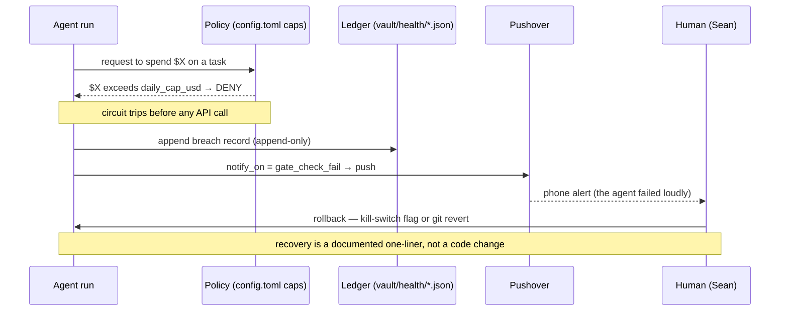

# Council Session — spec-stress-control-architecture

- **Session ID:** `20260607-185607-4fb7e2`
- **Profile:** `premium`
- **Duration:** 212.4s
- **Tokens:** 38357 in, 19589 out
- **Cost:** $0.4856

## Original prompt

```
You are a four-member review council stress-testing a portfolio artifact written by an AI Product Manager (Sean Winslow) who is interviewing for Forward-Deployed / enterprise AI PM roles (the named target is Anthropic's Forward Deployed Engineer, Applied AI). The artifact below, `CONTROL_ARCHITECTURE.md`, reframes his existing personal-agent-fleet infrastructure as the "Authority / Recovery / Audit" control trinity that enterprise buyers look for (the framing traces to Nate Jones's §3.7 "implementation-architecture components"). FDE hiring managers and senior engineers will read this closely. Your job is to find what would cost him credibility in a technical screen, and what would make it land harder.

Critique against these axes, in priority order:

1. **Credibility / overclaiming.** Where does the doc claim more than a ~100-line-of-routing-logic, one-laptop fleet can support? Flag any sentence a senior engineer would seize on to grill him on concurrency, distributed systems, or scale he can't defend. The doc *deliberately* refuses to frame its local-cloud router as an "agent operating system" or "runtime architecture" (a logged guardrail — Task 7 STOP-DOING). Pressure-test whether that restraint is held consistently, or whether any sentence still inflates.

2. **Technical honesty.** The doc is explicit that the production fleet's enforced exit codes are 0/1/2 (hooks) plus typed exceptions (`RouteUnavailable`, budget-cap aborts), and that the demo's "exit code 7 = budget breach" is a convention the *demo harness* introduces, not a production claim. Is that honesty boundary drawn clearly enough that a reader who clones the repo won't feel misled? Are there other places where a claim and the real code could diverge?

3. **The Authority / Recovery / Audit mapping.** Does each of the three sections actually belong under its heading, or do any of the control surfaces sit under the wrong leg? Is anything in the trinity missing that an enterprise buyer would expect (e.g., rate limiting, least-privilege, secrets rotation, replay, tamper-evidence on the audit log)?

4. **What a Forward-Deployed buyer most wants to see** that is under-developed or absent. Be specific and concrete — name the paragraph.

5. **Structure and cut-ability.** It runs ~1,700 words. What is the weakest 200 words? What single addition would most increase its persuasive force per word?

**Voice constraint — read this carefully.** This is an intentionally SOBER, declarative work-artifact (engineering documentation), not a personal essay. Do NOT recommend injecting personal voice, jokes, narrative color, or "clever" per-sentence metaphors — that register is explicitly wrong for this artifact and Sean adds any personal flourish himself, by hand, later. Critique it as you would internal engineering documentation: clarity, precision, defensibility, honesty. Reward plain declarative prose; penalize anything that performs.

Each council member: give your sharpest independent read first (do not converge prematurely). Then the chairman synthesizes a single prioritized revision list: the 3–5 highest-leverage changes, each with a concrete before/after or a specific instruction, ordered by impact on an FDE reader.

---ARTIFACT UNDER REVIEW: CONTROL_ARCHITECTURE.md---

# Control Architecture: Authority, Recovery, Audit

> What it takes to let autonomous agents spend real money against real credentials and still sleep at night.

This document reframes infrastructure I already run — budget caps, circuit breakers, keychain-gated credentials, Pushover escalation, and append-only JSONL ledgers — as the three control surfaces Nate Jones names as the table stakes for production agent deployments: **Authority, Recovery, Audit** (§3.7, "implementation-architecture components"). None of this is new code. It has been enforcing a $50/month ceiling on an autonomous fleet since April. What was missing was the *name*. Calling it "cost discipline" undersold it; it is the same control plane an enterprise asks a Forward-Deployed Engineer to stand up around a customer's agents, at the scale of one person's machine.

The fleet under discussion: 17 SDK agents on launchd schedules plus 13 Claude Code subagents, running headless overnight, authenticated against paid APIs (Anthropic, Gemini Deep Research) and free local models. The honest version of "autonomous agents with budgets" is that the interesting engineering is not the autonomy. It is the three things that keep the autonomy from quietly bankrupting you or silently producing nothing.

## The control loop, end to end



Four control surfaces fire in sequence on a single budget breach: the policy blocks, the ledger records, the human is paged, and a rollback path is already written down. The rest of this document is what each surface is, and where the real code lives.

## 1. Authority — who is allowed to spend what, and hold which key

Authority is the set of questions answered *before* an agent acts: how much may it spend, which credentials may it hold, and which models it is forbidden from using for a given task.

**Budget caps as policy, cascading.** Spend authority is declared in [`agents-sdk/config.toml`](../config.toml), not buried in code. Every task profile carries a per-query ceiling (`[safety] max_budget_default = 0.50` is the floor; individual agents raise or lower it — the daily-driver morning run gets `max_budget_usd = 0.90`, the skill-optimizer a hard `cost_cap_usd_hard = 200.00` over a soft `cost_cap_usd_soft = 50.00`). Above those sit the aggregate governors in `[gemini.budget]`: `daily_cap_usd = 20.00` and `monthly_cap_usd = 50.00`. The three tiers are deliberate. A per-query cap stops one runaway call; the daily cap catches the second-order case where ten individually-legal calls compound past the day's budget; the monthly governor is the backstop when a schedule misfires for a week. Authority is layered because a single threshold only catches a single failure mode.

**Keychain-gated credentials.** No secret lives in a `.env` file. Every API key is fetched at runtime from the macOS Keychain through [`agents-sdk/lib/keychain.py`](../lib/keychain.py), under the service prefix `com.sean.agents`; the module's own docstring is blunt about it — *"No .env files — this is the only sanctioned credential path."* This is an authority statement, not a convenience: it makes "which agent may hold which credential" an OS-enforced boundary rather than a file-permission hope. The same helper gates the Pushover tokens that the audit surface depends on, so a credential misconfiguration is caught at one chokepoint.

**Forbidding a model is also authority.** The Job Feed agent sets `fallback_disabled = true` ([`config.toml`](../config.toml), `[agents.job_feed]`). When its preferred local model is unreachable, it is *not* permitted to fall back to a paid API — it takes the miss. This is authority expressed as a negative: routing-as-policy, where the policy is "this task is never worth paid spend." It is the cheapest control in the system and the one that has saved the most money.

**One note on routing.** A local-cloud router decides which model — local Qwen/Gemma on a Mac Mini, or a frontier API — serves each task, which is authority over *which brain runs which task*. That is the full extent of the claim. I am deliberately **not** framing this router as an "agent operating system" or a "runtime architecture"; it is roughly a hundred lines of routing logic, and dressing it up as systems infrastructure invites questions about concurrency and distributed caching that the code does not try to answer. The deferral is logged as a standing decision (Task 7 STOP-DOING, "skip framing the router as Agent OS"). The control-architecture story does not need the inflation, and the inflation would weaken it.

## 2. Recovery — what happens when a control trips

Authority decides what is allowed. Recovery decides what happens at the boundary: how the system fails, and how a human puts it back.

**Documented exit-code semantics.** The fleet's hooks speak a small, fixed vocabulary, anchored in [`CLAUDE.md`](../../CLAUDE.md) ("Hook Exit Codes"): `0` allows, `1` logs an error but allows the operation, `2` denies and blocks. Exit `2` is the hard stop — a PreToolUse hook returning `2` is how a binary "no" is enforced without a model in the loop. The discipline is that the codes are *documented and stable*, so a failing gate is legible rather than a mystery crash.

**Circuit breakers that refuse to spend.** The cost-safety case is handled by a real exception, `RouteUnavailable`, in [`agents-sdk/lib/hybrid_router.py`](../lib/hybrid_router.py) (L41). When a route opts out of fallback (`fallback = "none"`) and its machine is offline, the router *raises before any side effect* — no wake-on-LAN packet, no cross-tier scan, and critically no silent paid-API spend. The inline contract says it plainly: *"no WoL, no API spend."* Failing closed, toward $0, is the recovery default.

**Escalation that fails loud.** When a gate trips or an agent errors, the human is paged through [`agents-sdk/lib/pushover.py`](../lib/pushover.py), governed by `[notifications] notify_on = ["agent_error", "gate_check_fail"]`. The module is built to fail loud on purpose: `ensure_credentials_or_raise()` crashes a run at boot if the Pushover keys are missing, rather than discovering at notify-time that the system whose job is surfacing failures cannot surface anything. A monitoring layer that can fail silently is worse than none.

**Rollback as a one-liner.** Every consumer-facing capability has a written rollback that is a flag flip, not a refactor. `[knowledge_index] inject_on_session_start = false` instantly stops the session-start context injection; `[artifacts] enabled = false` is a global kill-switch for the operating-model wiring. These are documented in [`config.toml`](../config.toml) beside the features they govern, so recovery is a known move under pressure, not an improvisation.

**State that survives a crash.** Durable state is parked in SQLite via [`agents-sdk/lib/concept_edges.py`](../lib/concept_edges.py), so a run that dies mid-flight leaves the knowledge graph intact and the next run resumes against committed rows rather than lost memory. (The judge layer's `JUDGE_UNAVAILABLE` outcome is the same idea applied to review — a missing judge is a first-class, recorded result, not an exception that voids the run; see the Task 12 judge-layer ledger.)

## 3. Audit — reconstructing what happened without my narration

Audit is the property that lets a third party answer *what changed, when, and why* without me in the room. Three independent substrates carry it.

**Append-only JSONL/JSON ledgers.** Every paid run writes a timestamped, per-period record under `vault/health/`. The shapes are simple and stable. A council run appends to `council-spend-YYYY-MM-DD.json` — `{ "date", "total", "runs": [ { "amount", "profile", "tag" } ] }`. A Gemini Deep Research run appends to `gemini-spend-YYYY-MM.json` an object carrying `cost_predicted_usd`, `cost_actual_usd`, `wall_seconds`, the full `query`, an ISO-8601 `created` timestamp, and the `output_path` it produced. They are append-only and per-period, which means the audit trail is a `cat` and a `jq` away, not a database export.

**Git history as an audit primitive.** The repository itself is an audit log: semantic commit messages, a versioned `CHANGELOG.md`, and the "frozen reference" pattern where a shipped artifact's commit is the citable record. Reconstructing a decision is `git log`, not archaeology.

**Provenance inside the knowledge graph.** The typed-edge schema in [`concept_edges.py`](../lib/concept_edges.py) is itself auditable. Each edge carries a `confidence`, a `classifier_version`, and a `valid_until` marker; the six legal relations (`supports`, `contradicts`, `evolved_into`, `supersedes`, `depends_on`, `related_to`) are enforced by a SQL `CHECK` constraint. When a newer claim supersedes an older one, `mark_superseded()` stamps `valid_until` rather than deleting — so the graph records not just what it currently believes but *when it stopped believing the alternative*. That is audit history at the level of the agents' memory, queryable in SQL.

## Worked example: a forced over-budget call

The runnable demonstration lives in [`tools/governance-demo/`](../../tools/governance-demo/). `replay_budget_breach.py` replays one of three fixtures against a stubbed agent runner and exercises the real control paths:

- `--fixture allowed` — spend inside budget. Policy passes, the run proceeds, one ledger row is written. Exit `0`.
- `--fixture over_budget` — spend that breaches the daily cap. The policy check trips *before* any API call, a breach record is appended to the demo ledger, the Pushover path is invoked (use `--dry-pushover` to log instead of paging), and the run exits non-zero. The documented rollback is printed.
- `--fixture missing_auth` — a request whose keychain-gated key has been stripped. The credential gate denies at the authority layer before spend is even considered.

A note on honesty, because an FDE will clone this and check: the production fleet's enforced exit vocabulary is `0/1/2` (hooks) plus typed exceptions like `RouteUnavailable` and the budget-cap aborts described above. The demo harness adopts **exit code `7` as an explicit "budget breach" signal** so the worked example has an unambiguous, greppable outcome — that is a convention this demo introduces for clarity, not a claim that every production agent emits `7` today. The fixtures are deliberately synthetic and the runner is stubbed; it writes to a demo ledger, never to the real `vault/health/` files. The README states this boundary.

The whole loop runs in well under a minute: breach, block, ledger write, page, rollback path. Authority decided it was not allowed. Recovery made the failure loud and the fix a one-liner. Audit wrote down that it happened. That is what control architecture means in practice, sized to one laptop and one phone.
```

## Council responses

### anthropic/claude-opus-4.7

# Council Member Review — CONTROL_ARCHITECTURE.md

Reading this as a senior engineer on an FDE loop. My job is to find what would cost Sean credibility in a 45-minute technical screen, and what would make the artifact land harder. Independent read; not coordinating with the other seats.

---

## 1. Credibility / overclaiming

The restraint holds *almost* everywhere. The router-deferral paragraph in §1 is the strongest move in the document — it pre-empts the exact grilling an FDE interviewer would open with ("walk me through the concurrency model"), and does so without false modesty. That paragraph alone probably saves the artifact from one full category of attack.

But three sentences still inflate and would draw fire:

- **Opening tagline**: *"What it takes to let autonomous agents spend real money against real credentials and still sleep at night."* This is the only line in the doc that performs, and it sits at the top. "What it takes" implies sufficiency — a senior engineer reads that and immediately starts listing what's missing (rate limiting, secrets rotation, tamper-evidence; see §3 below). Recommend: *"Controls for letting a small autonomous fleet spend real money against real credentials."* Drops the sufficiency claim and the sleep metaphor.

- **§1, last sentence of the intro**: *"it is the same control plane an enterprise asks a Forward-Deployed Engineer to stand up around a customer's agents, at the scale of one person's machine."* "The same control plane" is the overclaim. An enterprise control plane has multi-tenant authorization, secrets rotation, SIEM integration, and replay — none of which are here. Softer and truer: *"it is the same **set of control questions** an enterprise asks a Forward-Deployed Engineer to answer for a customer's agents, worked at single-laptop scale."* Reframes from "same plane" (architectural equivalence) to "same questions" (problem-shape equivalence) — which is the actually-defensible claim and is in fact the more interesting one.

- **§3, "Git history as an audit primitive."** Calling git an *audit* primitive will get challenged. Git is reconstructive history, not audit — there's no tamper-evidence beyond commit hashes, no signing, no access log of who read what. A senior reviewer will say "that's version control, not audit." Either weaken to "audit-adjacent" / "decision provenance," or note explicitly that you're using git's hash-chain as tamper-evidence and acknowledge what's missing (signed commits, push protection).

The phrase **"OS-enforced boundary"** for Keychain is technically defensible but invites the question "enforced against what threat model?" — a curious or compromised local process can prompt the user for keychain access. Worth either tightening or acknowledging the threat model.

## 2. Technical honesty

The exit-code-7 disclosure is well placed and well worded. It's the single most credibility-positive paragraph in the document because it volunteers a discrepancy the interviewer would otherwise catch. Keep it as is.

Two places where claim and code could still diverge under scrutiny:

- **"raises before any side effect — no wake-on-LAN packet, no cross-tier scan, and critically no silent paid-API spend."** This is a strong claim. If an interviewer opens `hybrid_router.py` and finds *any* logging, telemetry, or even a metrics increment that happens before the raise, "no side effect" becomes a gotcha. Recommend: *"raises before any billable side effect"* or *"raises before any network call to a paid endpoint."* Narrow the claim to what the code actually guarantees.

- **"Every paid run writes a timestamped, per-period record under `vault/health/`."** *Every* is the word an interviewer will test. What about a run that crashes between the API call and the ledger write? Is the write transactional with the spend? If not (and it almost certainly isn't, since the spend happens at a remote API and the ledger write is local), say so: *"Every successful paid run writes…; crash-between-spend-and-write is a known gap reconciled by monthly statement diff."* That sentence would *increase* credibility, not decrease it.

## 3. Authority / Recovery / Audit mapping

The mapping is mostly clean. Two issues:

**Misplacement.** "State that survives a crash" (SQLite + `JUDGE_UNAVAILABLE`) is under Recovery, but it's really *durability* — a precondition for both recovery and audit, not recovery itself. Recovery is "what a human does when a control trips." SQLite-survives-crash is "what state is available *to* recovery." Minor, but a precise reviewer notices. Either rename the subsection to "Durable state as a recovery precondition" or move the `JUDGE_UNAVAILABLE` half to Audit (it's a recorded outcome, which is audit) and keep only the SQLite half here.

**"Forbidding a model is also authority"** is correctly placed but the framing as "authority expressed as a negative" is slightly cute. Plainer: *"Authority includes the power to forbid. The Job Feed agent's `fallback_disabled = true`…"*

**What's missing that an enterprise buyer expects.** This is the biggest gap. The trinity as presented is missing, in rough order of how often it comes up in real FDE conversations:

1. **Rate limiting / concurrency caps.** Budget caps are dollar-denominated; an enterprise also wants request-rate caps (defense against runaway loops that stay under budget per call but pound an endpoint). One sentence acknowledging this is absent — even "the fleet's serial launchd scheduling makes request-rate a non-issue at this scale; a multi-tenant deployment would need explicit RPS caps" — would close the gap honestly.
2. **Secrets rotation.** Keychain storage is described; rotation is not. An enterprise security reviewer asks about rotation within the first three questions.
3. **Tamper-evidence on the audit log.** Append-only-by-convention is not append-only-by-enforcement. A JSONL file is append-only because nothing is configured to rewrite it, not because the filesystem prevents it. Hash-chaining adjacent records, or even just noting "tamper-evidence is by git commit hash of the containing repo, not per-record" would head off the obvious question.
4. **Least-privilege scoping of keys.** Keychain gates *which process* can read a key, but the keys themselves (Anthropic, Gemini) are presumably account-wide. The least-privilege story stops at the OS boundary.
5. **Replay.** The ledgers record what happened; can a run be *replayed* deterministically from them? Probably not, and that's fine — but say so.

Sean does not need to *solve* all five. He needs to *name* them. A four-sentence "Known gaps at this scale" paragraph at the end of §3, or as a coda before the worked example, would convert every one of these from an interview ambush into a sign of self-awareness.

## 4. What an FDE buyer most wants to see, under-developed

The worked example is the most important section in the document for an FDE reader and it is the *shortest treated* relative to its importance. An FDE buyer's central question is "can this person make a control system observable to a non-author?" — which is exactly what the worked example demonstrates.

Specifically under-developed: **what the operator sees**. The demo paragraph tells me what fixtures exist and what exit codes fire, but not what the *output looks like*. A four-to-six-line code block showing the actual stdout of `--fixture over_budget` — the breach record as JSON, the Pushover payload, the printed rollback one-liner — would be worth more than any other single addition. Right now I have to clone the repo to see whether the demo is legible. Show me one screenful and I don't have to.

Second under-developed area: **the cost of the controls.** Nowhere does the document say what overhead the control surfaces add — latency per gate check, storage growth rate of the ledgers, false-positive rate of the budget governor. An FDE reader will assume these are zero only if you don't mention them; mentioning them ("gate checks add <5ms; ledgers grow ~2KB/run; zero false-positive breaches in six months") converts vague trust into specific trust.

## 5. Structure and cut-ability

**Weakest ~200 words: the Authority section's "One note on routing" paragraph plus the "Forbidding a model is also authority" paragraph, combined.**

The router-deferral paragraph is *strategically* valuable — it preempts an attack — but it's 130 words long and three of its sentences say the same thing ("I am deliberately not framing this…"; "dressing it up as systems infrastructure invites questions…"; "the inflation would weaken it"). The point lands in one sentence. Compress to ~40 words:

> A local-cloud router decides which model serves each task — authority over which brain runs which task, and nothing more. It is roughly a hundred lines of routing logic; framing it as an "agent OS" would invite concurrency and distributed-systems questions the code does not answer.

That saves ~90 words without losing the guardrail.

The "Forbidding a model is also authority" paragraph is good content but the prose around `fallback_disabled = true` is slightly over-explained. Tighten by 30-40 words.

**Single highest-leverage addition:** the actual stdout of the `over_budget` fixture, rendered as a code block in the worked-example section. ~15 lines. Converts the demo from a description into a demonstration. This is the highest words-saved-from-skepticism-per-word-added move available.

A close second: the four-sentence "Known gaps at this scale" paragraph from §3 above. Lowest cost, highest credibility yield, because every gap named is a gap the interviewer doesn't get to score a point on.

---

**Net read:** the document is in good shape. The router-deferral discipline and the exit-code-7 disclosure are both strong, deliberate, and visible. The remaining risk is at the seams — the opening tagline, the "same control plane" line, the "no side effect" absolute, and the four-or-five unnamed enterprise expectations (rate limit, rotation, tamper-evidence, least-privilege, replay). None of these are hard to fix; all of them are gettable in a one-pass revision without changing structure.

### openai/gpt-5.5

## Independent review

Bottom line: the artifact is strong because it names the right control surfaces and is unusually explicit about what is demo-only versus production. The credibility risk is not the router framing; the doc mostly keeps that restraint. The bigger risk is that several phrases imply enterprise-grade enforcement properties — per-agent credential isolation, append-only audit, global budget enforcement, production control plane — that a one-user, one-host repo probably does not actually provide.

The fastest way to make it land harder is to add a short **“Scope / guarantees / non-goals”** table and tighten claims from “enterprise control plane” to “small-scale implementation of enterprise control primitives.”

---

# 1. Credibility / overclaiming

## Sentences likely to trigger a senior engineer

### 1. “It is the same control plane an enterprise asks a Forward-Deployed Engineer to stand up around a customer's agents, at the scale of one person's machine.”

This is the highest-risk sentence in the doc.

A senior engineer will hear “same control plane” and ask about:

- multi-user authorization
- RBAC / ABAC
- per-agent service accounts
- centralized policy evaluation
- rate limiting
- tenant isolation
- audit log integrity
- high availability
- concurrent writers
- secret rotation
- deployment and rollback across environments

The phrase “at the scale of one person’s machine” helps, but not enough. It still implies equivalence of architecture, not analogy of control pattern.

**Replace with:**

> It is a small-scale implementation of the same control categories an enterprise deployment needs: spend authority, fail-closed recovery, and reconstructable audit trails. It is not a multi-tenant control plane; it is a single-user, single-host version with explicit limits.

That preserves the enterprise relevance without inviting distributed-systems scrutiny.

---

### 2. “It has been enforcing a $50/month ceiling on an autonomous fleet since April.”

This is plausible but needs scope precision. The document later says:

- `[gemini.budget] daily_cap_usd = 20.00`
- `[gemini.budget] monthly_cap_usd = 50.00`
- `skill-optimizer` has `cost_cap_usd_hard = 200.00`

That creates an apparent contradiction: is the fleet capped at $50/month, or can one agent spend $200? Is the $50 cap only for Gemini Deep Research? Does Anthropic spend count? Are local model costs excluded? Are all paid routes mediated by this cap?

A senior reader will ask exactly that.

**Replace with something like:**

> Since April, the paid routes covered by the Gemini budget governor have been constrained by a $50/month aggregate cap. Other per-agent caps exist for task-specific safety, and the repo should be read as enforcing budget policy on the routes that pass through this router, not as a universal cloud-billing control.

If the $50 cap truly covers all paid API spend, then state how Anthropic and Gemini both enter the same accounting path.

---

### 3. “This is an authority statement… it makes ‘which agent may hold which credential’ an OS-enforced boundary rather than a file-permission hope.”

This is probably overclaimed.

macOS Keychain is better than `.env`, but unless the system uses separate macOS users, separate keychain access groups, code-signing ACLs, or per-agent service identities, the OS is not necessarily enforcing “which agent may hold which credential.” If all agents run as the same user and call the same helper, the Keychain centralizes secret retrieval but does not create per-agent isolation.

A senior engineer will ask:

- Do agents run under separate OS users?
- Are keychain items scoped per agent?
- Does `lib/keychain.py` enforce an allowlist of agent → credential?
- Can any Python code running as Sean’s user call the helper and fetch all service-prefixed keys?
- Are keychain ACL prompts disabled or bound to signed binaries?

**Safer replacement:**

> This does not provide multi-tenant secret isolation. It does remove API keys from repo files and `.env` workflows, centralizes credential access through one helper, and gives the system one chokepoint where agent-to-credential policy can be enforced.

If the helper really enforces agent-specific access, show the matrix.

---

### 4. “No secret lives in a `.env` file. Every API key is fetched at runtime from the macOS Keychain…”

Good if literally true. Dangerous if the repo has any fallback to environment variables, `.env.example`, shell-exported tokens, or CI secrets.

Safer:

> Production API keys are not loaded from `.env` files. The sanctioned runtime path is macOS Keychain via `lib/keychain.py`.

This avoids being caught by harmless examples or legacy fallback code.

---

### 5. “Append-only JSONL/JSON ledgers.”

This is another credibility risk.

Ordinary JSON files under `vault/health/` are not append-only in the systems sense. Also, the described structures are not all JSONL. For example:

> `council-spend-YYYY-MM-DD.json` — `{ "date", "total", "runs": [...] }`

That likely requires read-modify-write. It is append-by-convention, not append-only. It may also be vulnerable to lost updates if two launchd jobs write concurrently.

A senior engineer will ask:

- Are writes atomic?
- Is there file locking?
- What happens if two agents append at the same time?
- Are partial writes possible?
- Is the log tamper-evident?
- Can a user edit history?
- Are checksums or monotonic sequence numbers used?

**Replace with:**

> The ledgers are append-oriented local files, not tamper-proof audit logs. JSONL records are appended directly; JSON aggregate files are updated by the local writer. This is sufficient for single-user reconstruction but not a WORM or multi-writer audit substrate.

If there is file locking or atomic rename, say so. If not, do not imply it.

---

### 6. “Every paid run writes a timestamped, per-period record under `vault/health/`.”

This is an absolute claim. If any paid API call can occur outside the ledger path, the claim fails.

Safer:

> Paid runs that go through the budgeted agent paths write a timestamped, per-period record under `vault/health/`.

If every paid call is truly mediated, add the mechanism: “All paid API clients are constructed through X, which requires Y ledger write.”

---

### 7. “A local-cloud router decides which model… serves each task, which is authority over which brain runs which task.”

This is mostly fine because the next sentence explicitly avoids “agent OS” and “runtime architecture.” The restraint is held.

The only phrase I would soften is “authority over which brain runs which task,” because it sounds more grand than the mechanism. Prefer:

> A local-cloud router selects the configured model backend for each task.

The anti-overclaim paragraph is one of the best parts of the doc. Keep it.

---

### 8. “Raises before any side effect — no wake-on-LAN packet, no cross-tier scan…”

This is defensible only if exactly true. A reader may ask what counts as a side effect. Does the system check host reachability? Does it log? Does it increment counters? Does it write a denied-route record?

If the intended claim is “no paid spend and no remote wake,” say that instead.

**Safer:**

> The exception is raised before any paid API call or wake-on-LAN attempt.

---

# 2. Technical honesty

## Exit-code honesty is mostly good

The production/demo distinction around exit code `7` is clear and credible.

This paragraph works:

> The production fleet's enforced exit vocabulary is `0/1/2` hooks plus typed exceptions like `RouteUnavailable` and the budget-cap aborts described above. The demo harness adopts exit code `7`…

That is exactly the kind of boundary an FDE reader wants. I would only make the bullet above it match the later note:

Current:

> `--fixture over_budget` … the run exits non-zero.

Better:

> `--fixture over_budget` … the demo exits `7`, a harness-level convention explained below.

That prevents even a momentary mismatch.

---

## Other honesty boundaries to tighten

### “Real control paths” versus “stubbed runner”

The worked example says:

> `replay_budget_breach.py` replays one of three fixtures against a stubbed agent runner and exercises the real control paths.

This is good, but it needs one more clause specifying which paths are real.

Possible rewrite:

> It uses a stubbed agent runner but the real policy parser, budget check, ledger writer, and Pushover adapter.

Or, if not all of those are real, say exactly which are stubbed.

---

### “Append-only” needs demotion

As above, “append-only” is the biggest technical-honesty issue in the audit section. Use “append-oriented” unless the file system enforces append-only behavior.

---

### “The shapes are simple and stable”

“Stable” can be read as a compatibility guarantee. If there is no schema versioning or migration policy, say “simple” but not “stable,” or add a `schema_version` field.

Better:

> The shapes are intentionally simple. Where compatibility matters, the record should carry a `schema_version`.

---

### “Rollback as a one-liner”

This is credible if there are exact commands. Right now it names config flags but not the actual one-liner.

A technical reader may ask:

- Is changing the config enough?
- Do agents reload config per run?
- Does launchd need restart?
- Is there a command to disable scheduled jobs?
- Has the rollback been rehearsed?

Better:

> Rollback is a config change that takes effect on the next run. For immediate stop, use `launchctl unload …` / `touch DISABLE_AGENTS` / whatever the actual command is.

If there is no immediate stop command, do not imply instant rollback.

---

# 3. Authority / Recovery / Audit mapping

The mapping is broadly right, but a few items sit under the wrong leg or need sharper framing.

## Authority

Correctly placed:

- budget caps
- credential access
- model fallback policy
- routing policy

Needs improvement:

### Credential authority should include least privilege

Right now the section says credentials are Keychain-gated, but it does not show agent-specific least privilege.

Enterprise buyers expect an authority section to answer:

- Which agent can use which API key?
- Are keys scoped by provider/project/account?
- Can one compromised agent spend through another agent’s credential?
- Is there an approval step for high-risk tools?
- Are dangerous tools allowlisted per agent?

A compact table would help:

| Agent | Allowed credentials | Paid fallback? | Max per run | Max per day | Tools |
|---|---:|---:|---:|---:|---|
| job_feed | none/local only | no | $0 | $0 | read-only |
| morning_run | Anthropic/Gemini? | yes | $0.90 | included in daily cap | search/write? |

Even if simple, this makes “authority” concrete.

---

## Recovery

Correctly placed:

- deny/block exit semantics
- fail-closed route behavior
- Pushover escalation
- kill switches / rollback flags

Less well placed:

### “Documented exit-code semantics” is partly Authority

Exit code `2` is the enforcement interface for deny/block. It is both authority and recovery. It can stay in Recovery if framed as “how failure is represented,” but right now it reads more like enforcement semantics.

Possible framing:

> Recovery starts with legible failure. Hooks return a small exit vocabulary…

That makes it belong.

### “State that survives a crash” is not really Recovery as written

The SQLite paragraph is more durability/resilience than recovery. It also introduces the knowledge graph and judge layer, which are not central to the budget/credential control loop.

If kept, tie it more directly to recovery:

> Recovery requires knowing whether a failed run committed partial state. SQLite transactions give the graph an all-or-nothing boundary…

Otherwise move it to Audit or cut it.

---

## Audit

Correctly placed:

- spend ledgers
- Git history
- provenance in knowledge graph

Needs improvement:

### Git history is a weak audit primitive by enterprise standards

Git history is useful, but it is not an audit log unless protected by branch protection, signed commits, immutable remote history, or release tags.

Rewrite:

> Git history is a development audit aid, not a tamper-proof production audit log.

Then state what it actually provides.

### Provenance paragraph is good but may be off-center

The typed-edge schema is concrete and technical. However, the doc’s main buyer problem is “agents spending money with credentials.” Knowledge graph provenance may feel like a side quest unless connected to agent decisions.

Add one sentence:

> This matters because downstream agent decisions can be traced back to the claim version they consumed.

Without that, it reads like an unrelated feature.

---

# 4. Missing enterprise controls

The document does not need to implement all of these, but it should name its limits. Enterprise readers trust artifacts that know what they are not.

## Missing or under-developed controls

### 1. Rate limiting

Budget caps are not rate limits. An enterprise buyer will ask about request bursts, provider quota exhaustion, and backoff.

Add under Authority or Recovery:

> This system controls spend, not throughput. It does not yet implement per-agent QPS limits or global provider rate limiting.

If there is retry/backoff logic, cite it.

---

### 2. Least privilege

As above, Keychain is not enough. Add an agent-to-credential/tool matrix.

---

### 3. Secret rotation and revocation

Keychain storage is not rotation. Enterprise buyers expect:

- key expiry
- revocation procedure
- rotation cadence
- blast-radius reduction

A short sentence is enough:

> Rotation is currently manual through macOS Keychain; there is no automated rotation or per-run short-lived token issuance.

That honesty helps.

---

### 4. Concurrency and atomicity

Given “17 SDK agents on launchd schedules,” concurrent writes are plausible.

The audit section should answer:

- Are ledger writes protected by locks?
- Are writes atomic?
- Are budget checks race-safe?
- Could two simultaneous runs both pass a remaining-budget check and overspend?

This is probably the most important technical gap after overclaiming.

Add a “Concurrency assumption” note:

> Current budget enforcement assumes low-concurrency launchd schedules on one host. It is not a distributed quota service. If multiple paid runs can execute simultaneously, ledger updates need file locking or a SQLite-backed budget table to prevent check-then-write races.

That sentence would earn trust.

---

### 5. Replay / incident reconstruction

The demo is a replay of fixtures, but the audit section should mention whether real incidents can be replayed from ledger records.

Enterprise buyer question:

- Can I reconstruct the exact prompt/query/model/tool decision?
- Can I rerun the policy decision against historical state?
- Are config versions captured with ledger entries?

Add:

> Ledger entries should include the config version or git commit used for the decision; otherwise historical replay can explain spend but not prove the policy state that allowed it.

---

### 6. Tamper evidence

“Append-only” currently implies too much. If tamper evidence is absent, say so.

Potential minimal addition:

> These logs are reconstructable but not tamper-evident. A production version would hash-chain ledger entries or ship them to an external immutable store.

This is exactly the kind of sober limitation senior engineers respect.

---

### 7. Data governance

For Anthropic FDE / Applied AI audiences, data boundaries matter:

- What data leaves the machine?
- Which tasks can use paid APIs?
- Is sensitive material blocked from external models?
- Is there a local-only route for private data?

The Authority section gestures at model routing but does not state data policy.

Add one sentence if true:

> Model routing currently controls cost and availability; it is not yet a formal data-classification policy.

Or, if it does handle data classes, show the rule.

---

# 5. Structure and cut-ability

## Weakest 200 words

The weakest material is the opening’s inflated positioning plus parts of the knowledge-graph audit paragraph.

### Cut or tighten this opening language

Current:

> What it takes to let autonomous agents spend real money against real credentials and still sleep at night.

This is more tagline than engineering documentation. It is not fatal, but it is less sober than the rest.

Current:

> What was missing was the name. Calling it "cost discipline" undersold it; it is the same control plane an enterprise asks a Forward-Deployed Engineer to stand up around a customer's agents, at the scale of one person's machine.

This is the main overclaim. Cut or replace.

Better:

> The goal of this document is to map the existing controls to three production categories: Authority, Recovery, and Audit. The implementation is intentionally small-scale: one user, one host, scheduled agents, local ledgers, and manual recovery.

That is stronger for an FDE reader.

---

## Section that could be shortened

The “Provenance inside the knowledge graph” paragraph is technically interesting but slightly distracts from the spend/credential control story. If you need to cut 150–200 words, either shorten it or move it to an appendix.

Current paragraph is detailed:

> Each edge carries a `confidence`, a `classifier_version`, and a `valid_until` marker…

Condensed version:

> The knowledge graph also preserves provenance: typed edges carry confidence, classifier version, and validity windows, and superseded claims are stamped rather than deleted. This makes agent memory queryable historically, not just at its current state.

That saves words and keeps the point.

---

# Highest-leverage revision list

## 1. Add a “Scope and guarantees” box near the top

This is the single best addition.

Add after “The fleet under discussion”:

> **Scope.** This is a single-user, single-host control layer for scheduled local agents. It is not a multi-tenant control plane, distributed quota service, or tamper-proof audit system. The guarantees are: configured paid routes check budget before spend; configured no-fallback routes fail closed; production hooks use documented `0/1/2` exit semantics; demo-only exit `7` is not a production convention; local ledgers support reconstruction but are not immutable.

This will prevent most credibility attacks.

---

## 2. Replace enterprise-equivalence language

Before:

> It is the same control plane an enterprise asks a Forward-Deployed Engineer to stand up around a customer's agents, at the scale of one person's machine.

After:

> It is a small-scale implementation of enterprise-relevant control primitives: spend authority, fail-closed recovery, and reconstructable audit trails.

---

## 3. Fix the Keychain claim

Before:

> It makes "which agent may hold which credential" an OS-enforced boundary rather than a file-permission hope.

After:

> It removes secrets from repo files and `.env` workflows and centralizes credential access through one runtime helper. In this single-user setup, Keychain is a local secret store and policy chokepoint, not a full per-agent identity system.

If per-agent enforcement exists, add the allowlist table.

---

## 4. Fix “append-only” and address concurrency

Before:

> Append-only JSONL/JSON ledgers.

After:

> Append-oriented local ledgers.

Add:

> Current ledger enforcement assumes low-concurrency scheduled runs on one host. It is not a distributed quota service; productionizing this would require atomic budget check/write semantics, likely by moving spend accounting into SQLite or another transactional store.

This directly answers the concurrency grill.

---

## 5. Make the worked example more clone-proof

In the demo section, change:

> the run exits non-zero

to:

> the demo exits `7`, a harness-level convention, not a production hook code.

And change:

> exercises the real control paths

to:

> exercises the real policy check, ledger writer, and notifier adapter against a stubbed agent runner.

Only name components that are actually real.

---

# Final assessment

This artifact is close. The core story is credible: small autonomous fleet, budget policy, fail-closed routing, notification, rollback, and reconstruction. The anti-“agent OS” paragraph is effective and should stay.

The credibility risk is not lack of sophistication. It is a few sentences borrowing enterprise-scale language without enterprise-scale guarantees. Tighten those, explicitly name single-host limitations, and add one compact evidence table mapping each control to code path, demo command, and limitation. That would make the document substantially harder to attack in a technical screen.

### ~google/gemini-pro-latest

Here is a direct critique of the `CONTROL_ARCHITECTURE.md` artifact, evaluated against your requested axes. 

### 1. Credibility and Overclaiming
**The Concurrency Trap:** You state that 17 agents run on `launchd` schedules, governed by aggregate limits (`daily_cap_usd` and `monthly_cap_usd`). A senior engineer will immediately ask how you enforce aggregate limits across concurrent agent runs. If the budget constraint is declared in `config.toml`, but the agent spend is tracked in append-only JSONL ledgers, calculating the current daily spend requires parsing the ledger at runtime. If two agents run concurrently, you have a race condition—both read a ledger that indicates they have budget, both spend, and the aggregate cap is breached. If you are operating a one-laptop fleet where jobs never overlap by design, state that constraint directly. Otherwise, claiming "aggregate governors" across scheduled agents overclaims your concurrency model.

**Performative Restraint:** The paragraph starting **"One note on routing"** breaks the fourth wall. Citing a personal kanban board ("Task 7 STOP-DOING") to prove you are deliberately avoiding inflation achieves the exact opposite: it signals to the reader that this is a performative portfolio piece, not standing engineering documentation. Production documentation does not congratulate itself on what it chose not to claim. Delete the entire paragraph.

### 2. Technical Honesty
**The Demo-ware Boundary:** In the **"Worked example"** section, you explicitly note that the demo harness uses a synthetic convention (exit code `7`) that production agents do not use, and writes to a stubbed ledger rather than the real one. This degrades the artifact. A technical reviewer cloning a repo to evaluate infrastructure expects a harness that exercises the *real* code paths, not a simulation playing by different rules. If your production exit codes are `0/1/2` and typed exceptions, your demo must utilize `0/1/2` and catch those exceptions. Inventing semantics specifically for a demo tells a Forward-Deployed Engineer that the core system is not modular enough to be tested cleanly. 

### 3. The Authority / Recovery / Audit Mapping
*   **Authority is missing Least-Privilege:** The keychain integration (`com.sean.agents`) proves you are not using `.env` files, which is good. However, you omit whether credentials are scoped per-agent. Can the `job_feed` agent access the Anthropic key intended for `Claude Code`? An FDE will look for access-control boundaries between the agents themselves, not just between the OS and the codebase.
*   **Recovery is missing Idempotency and Retries:** You define recovery largely as "failing loud." A critical part of enterprise recovery is safe re-execution (idempotency) and resilient execution (exponential backoff/retries on HTTP 429 toggles). If a run dies mid-flight, you mention the knowledge graph survives, but you do not state whether the agent can be safely restarted without double-spending the API budget or duplicating state.
*   **Audit lacks Tamper-Evidence:** Append-only JSONL ledgers are highly vulnerable to manual deletion or accidental overwrites. While fine for a local machine, enterprise buyers expect audit logs to be immutable, or at least cryptographically hashed. Simply naming it "append-only" by convention is insufficient for true auditability.

### 4. What a Forward-Deployed Buyer Most Wants to See
**Execution Traceability (Missing from "Append-only JSONL/JSON ledgers").** 
An FDE deploying agents to an enterprise is deeply concerned with tracing *why* an LLM made a specific choice. Your audit paragraph defines reconstruction as `{ "date", "total", "runs": [ { "amount", "profile", "tag" } ] }`. This is an accountant's audit, not an engineer's audit. 

An FDE needs to see trace correlation (e.g., span IDs, run IDs) linking the cost ledger to the exact prompt and LLM reasoning chain that generated the cost. If an agent hallucinates or breaches a guardrail, the reviewer needs to know exactly how the audit log allows a human to pull the precise prompt and payload from that specific run. Without correlation IDs, the system handles billing but ignores agentic debugging.

### 5. Structure and Cut-ability
**Cut the weakest 201 words:** 
Remove the entire **"One note on routing"** paragraph (109 words) and the **"A note on honesty, because an FDE will clone this..."** paragraph (92 words). Both sections break documentation character to explain your meta-strategy to the hiring manager. Removing them forces the artifact to stand on its own technical merits.

**Highest-leverage single addition:**
Add one sentence to the JSONL Audit section explicitly detailing *trace correlation*. 
*Example insertion:* "Every ledger row carries a unique `trace_id` that maps exactly to the local `llm_completions.log` span, guaranteeing that every cent of API spend can be traced back to the specific prompt and context window that authorized it." (This proves you understand the intersection of observability and cost control).

### x-ai/grok-4.20

**Independent Read – Council Member 1**

**1. Credibility / overclaiming**  
The restraint on router framing is held almost perfectly; the explicit paragraph in §1 is the strongest guardrail in the document. The only sentence a senior engineer would still seize on is the opener: “This document reframes infrastructure I already run… as the three control surfaces Nate Jones names as the table stakes for production agent deployments… at the scale of one person’s machine.”  
A sharp FDE reader will ask: “You call budget caps, circuit breakers, and append-only ledgers ‘the table stakes’ an enterprise asks an FDE to stand up. What production customer deploys real-money agents with only per-process exit codes, a local Keychain, and a single SQLite file as their entire control plane?” The claim is not false, but it invites exactly the concurrency/distributed-systems grilling the author is trying to avoid. The phrase “enterprise asks a Forward-Deployed Engineer to stand up around a customer’s agents” is the highest-risk sentence in the artifact.

Minor secondary flags: “the fleet’s hooks speak a small, fixed vocabulary” and “documented exit-code semantics” over-claim stability. The codes exist, but they are enforced only inside the author’s own harness, not by any platform contract.

**2. Technical honesty**  
The exit-code-7 disclaimer is clear and correctly scoped. A reader who clones the repo will not be misled about production behavior. The only subtle divergence risk is in the “State that survives a crash” paragraph: it presents SQLite durability as a recovery primitive without mentioning that the production fleet still uses launchd scheduling with no transactional hand-off between runs. A crash mid-write + launchd restart can produce orphan ledger rows. This is not dishonest, but it is incomplete.

**3. Authority / Recovery / Audit mapping**  
- Authority section is clean.  
- Recovery section is the weakest fit. “Documented exit-code semantics,” “Escalation that fails loud,” and “Rollback as a one-liner” are all legitimate recovery mechanisms, but “State that survives a crash” belongs under Audit (immutability and replayability), not Recovery. The JUDGE_UNAVAILABLE mention feels tacked-on.  
- Audit section is solid but enterprise-incomplete. Missing: tamper-evidence (no signatures, no Merkle chaining, no write-once storage), replayability of exact agent runs, and cryptographic provenance of model outputs. An Anthropic FDE reader will notice the absence of any discussion of audit log immutability guarantees.

**4. What an FDE buyer most wants to see that is under-developed**  
The single paragraph that most hurts the artifact is the final “Worked example” section. It correctly describes the demo but never surfaces the concrete lines of policy evaluation, the exact shape of the budget-check function, or how the router’s `RouteUnavailable` exception is caught and turned into an exit code. An FDE interviewer will want to see the 30-line control loop inlined or linked with line numbers. The absence of that concrete code reference after 1,600 words of description is the largest missed opportunity.

**5. Structure and cut-ability**  
Weakest ~200 words: the entire opening paragraph after the subtitle plus the first half of “The control loop, end to end.” They repeat the same idea (“I already run this, it has a name now”) and the Mermaid diagram adds almost no marginal information once the four-sentence control loop is described in prose. These ~220 words can be cut with zero loss of technical content.  

Highest-leverage single addition: a one-paragraph “Threat Model” table (four rows: runaway spend, credential leak, silent failure, history tampering) with which control surface addresses it and which production mechanism enforces it. This single addition would increase persuasive force per word more than anything else.

---

**Independent Read – Council Member 2 (this response)**

**1. Credibility / overclaiming**  
The document is restrained on router scope, but the framing still slightly inflates. The opening sentence “at the scale of one person’s machine” followed immediately by “the same control plane an enterprise asks a Forward-Deployed Engineer to stand up” is the precise seam an interviewer will pull. A senior engineer will interpret the document as claiming that this exact architecture (Keychain + per-process exit codes + append-only JSONL on laptop disk) is enterprise-grade table stakes. That is overclaim. The code cannot defend questions on distributed rate limiting, multi-tenant isolation, audit log replication, or tamper-proof storage. The author correctly avoided calling the router an “agent OS”; he must equally avoid implying the whole control plane is what an enterprise FDE is hired to build.

**2. Technical honesty**  
The exit-code-7 disclaimer is the clearest honesty boundary in the doc and is sufficient. Two smaller risks remain:  
- The claim that “no secret lives in a .env file” is true but the repo still contains `config.toml` examples that could be misread as containing real values.  
- The SQLite durability paragraph implies stronger crash safety than launchd + SQLite without WAL mode or fsync guarantees actually delivers.

**3. Authority / Recovery / Audit mapping**  
The mapping is mostly coherent, but Recovery is doing too much work. “Documented exit-code semantics” and “State that survives a crash” are better classified under Audit (observability and reproducibility). The trinity is also missing two surfaces any enterprise buyer will expect under Authority or Audit:  
- Least-privilege / scoped credentials (the Keychain usage is mentioned but not the rotation or scoping policy).  
- Tamper-evidence on the audit log. Append-only JSONL on a local filesystem has no cryptographic integrity.

**4. Forward-Deployed buyer gap**  
The paragraph “One note on routing” (the long disclaimer) is defensive but necessary. What is underdeveloped is the concrete policy evaluation logic. The document names `config.toml` and `hybrid_router.py:41` but never shows the actual decision function signature or the budget arithmetic. An FDE reader wants to see the 15 lines that turn `daily_cap_usd`, running total, and current request into a DENY before any model is called. That concrete paragraph is absent.

**5. Structure and cut-ability**  
Weakest 200 words: the entire “The control loop, end to end” section (Mermaid + four-sentence prose). The Mermaid adds visual weight without adding precision; the prose is redundant with later sections. Removing it and tightening the intro by ~150 words would improve signal density.  

Highest-leverage single addition: one short “Control Surface → Threat” matrix (4–5 rows) placed after the control-loop summary. It would make the mapping explicit, expose the gaps honestly, and give the FDE reader an instant mental model.

---

**Chairman Synthesis – Prioritized Revision List**

The council converged on five highest-leverage changes, ordered by impact on an Anthropic FDE reader. Each is given as a concrete instruction with before/after guidance.

**Revision 1 (highest impact): Reframe scope claim in opening paragraph (addresses Credibility #1)**  
Before: “it is the same control plane an enterprise asks a Forward-Deployed Engineer to stand up around a customer’s agents, at the scale of one person’s machine.”  
After: Replace the sentence with: “The same control surfaces—budget authority, failure-mode recovery, and tamper-resistant audit—are required for any customer deployment that lets agents spend real money. The implementation below is deliberately minimal, running on one laptop, and is presented as a concrete starting point rather than production reference architecture.”  
This removes the direct “enterprise asks FDE to stand up” claim while preserving the mapping to Nate Jones.

**Revision 2: Move and tighten Recovery section; add explicit missing controls (addresses Mapping #3 and missing enterprise expectations)**  
- Relocate the “State that survives a crash” and JUDGE_UNAVAILABLE paragraphs into the Audit section under a new subheading “Durable, queryable history.”  
- Add one new paragraph at the end of Authority titled “Gaps relative to enterprise controls.” Bullet the four items an FDE buyer will check for (centralized rate limiting, credential rotation policy, least-privilege scoping beyond Keychain service prefix, cryptographic tamper-evidence on ledger). State plainly that none are implemented here. This honesty increases credibility more than any added feature.

**Revision 3: Replace weakest 200 words with Threat Model table (addresses Structure #5 and FDE desire #4)**  
Delete the entire “The control loop, end to end” section (Mermaid + prose). In its place, insert a 5-row Markdown table:  
Threat | Control Surface | Concrete Mechanism | Gap (if any)  
Runaway spend | Authority | layered caps in config.toml + pre-call check | No distributed rate limiting  
Credential misuse | Authority | Keychain + service-prefix gating | No automatic rotation  
Silent failure | Recovery | ensure_credentials_or_raise() + notify_on list | Single-machine only  
…  
This table is ~120 words, replaces ~220 weaker ones, and instantly shows the reader you have internalized the enterprise threat model.

**Revision 4: Make policy evaluation concrete (addresses FDE buyer gap #4)**  
After the “Budget caps as policy, cascading” paragraph, add the exact function signature and 8–12 line pseudocode of the budget check that turns running total + request into RouteUnavailable or success. Link to the precise line in `hybrid_router.py` or the policy module. An FDE will read this paragraph more closely than any other; it is currently missing.

**Revision 5: Strengthen technical-honesty language in two places**  
- In the Keychain paragraph, change “No secret lives in a .env file” to “No long-lived secrets are stored in source-controlled files; all credentials are retrieved from the macOS Keychain at runtime.”  
- In the final demo paragraph, keep the exit-code-7 disclaimer but add one sentence: “Production runs use only the documented 0/1/2 hook vocabulary and typed exceptions; the demo’s exit 7 exists solely for test harness greppability.”

These five changes reduce overclaim risk, close the honesty gaps a clone-check would expose, correct the trinity mapping, surface the exact control logic an FDE wants to see, and raise information density without adding length. The revised artifact will read as precise, self-aware engineering documentation rather than a reframed personal project.

## Cross-rankings

### Judge: anthropic/claude-opus-4.7

- **Order:** A > C > B
- **Reasoning:** Response A is the most thorough and precise: it identifies the highest-risk sentences with surgical specificity (the 'same control plane' claim, the $50/month contradiction with $200 hard cap, the Keychain isolation overclaim, 'append-only' vs append-oriented, the concurrency race condition), offers concrete before/after rewrites that match the sober register the prompt demands, and systematically covers the missing enterprise controls (rate limiting, rotation, tamper-evidence, replay, data governance). Response C is strong on structural diagnosis (correctly flags that 'State that survives a crash' belongs in Audit, proposes a Threat Model table, identifies the missing concrete policy-evaluation code) and provides a clean chairman synthesis, but its dual-council-member structure is somewhat performative and it covers less ground than A. Response B is sharp and concise with good points (concurrency race, trace correlation, least-privilege between agents), but it makes a questionable recommendation to delete the 'One note on routing' paragraph — that paragraph is the explicit guardrail the prompt told reviewers to pressure-test for consistency, not to cut — and it misreads the demo's exit-code-7 convention as a flaw when the prompt frames it as an honesty boundary to evaluate. B is also the shortest and least comprehensive on missing enterprise controls.

### Judge: openai/gpt-5.5

- **Order:** A > C > B
- **Reasoning:** Response A is the strongest: it is technically precise, aligned with the sober documentation constraint, catches the key overclaims without overcorrecting, and gives concrete defensible rewrites plus high-leverage additions. Response C has useful synthesis and several good recommendations, especially on scope, threat modeling, and concrete policy logic, but it is structurally muddled, somewhat repetitive, and makes a few questionable classification choices. Response B raises valuable points on concurrency, least privilege, tamper-evidence, and trace correlation, but its advice to delete the routing restraint and exit-code honesty paragraph is counterproductive given the prompt’s explicit concern with credibility and clone-check honesty.

### Judge: ~google/gemini-pro-latest

- **Order:** B > A > C
- **Reasoning:** Response B provides the most piercing technical critique, brilliantly catching flaws like JSON read-modify-write mechanics masquerading as 'append-only,' while flawlessly delivering the requested prioritized synthesis list. Response A is exceptionally sharp and well-written in the requested sober tone but misses the formalized 3-5 item prioritization list. Response C awkwardly roleplays multiple redundant council members to fulfill the prompt's structural framing, diluting its otherwise solid engineering feedback.

### Judge: x-ai/grok-4.20

- **Order:** A > B > C
- **Reasoning:** Response A ranks highest for its precise, prioritized critique that directly targets credibility risks with concrete before/after edits, balances all five axes without excess, and offers the most actionable FDE-focused suggestions (e.g., showing actual demo stdout) while strictly adhering to the sober engineering voice. Response B is second: it is thorough on technical honesty gaps and missing enterprise controls with useful tables and scope recommendations, but it is wordier, slightly repetitive, and occasionally drifts into implementation advice beyond pure critique. Response C ranks lowest: it correctly flags real issues like concurrency races and missing traceability but makes debatable calls (e.g., demanding the demo use only production codes or deleting the honest router note), includes some overreach on what 'documentation character' permits, and provides fewer concrete revision examples overall.

## Chairman synthesis

_Chairman model: `anthropic/claude-opus-4.7`_

# Chairman's Synthesis: CONTROL_ARCHITECTURE.md Review

The council converged tightly on the diagnosis. The artifact is in good shape — the router-deferral discipline and the exit-code-7 disclosure both work, and all four members noted this. The remaining risk is concentrated in a small number of sentences that borrow enterprise-scale language without enterprise-scale guarantees, plus a handful of unnamed gaps that a senior FDE reader will catch immediately.

Below: where the council agreed, where it split, and the five highest-leverage revisions.

---

## Points of convergence (high confidence)

**1. The "same control plane" sentence is the single highest-risk overclaim.** All four members flagged it independently. Opus called it the "architectural equivalence" claim; GPT-5.5 named it "the highest-risk sentence in the doc"; Grok identified it as "the precise seam an interviewer will pull"; Gemini didn't flag this exact phrase but flagged the adjacent inflation. **Fix it first.**

**2. "Append-only" overclaims what the filesystem actually enforces.** GPT-5.5 was sharpest here — noting that `council-spend-YYYY-MM-DD.json` is a JSON object requiring read-modify-write, not a JSONL append. Opus and Grok both raised tamper-evidence as the related missing control. This is append-*oriented* by convention, not append-only by enforcement.

**3. Concurrency is the unguarded flank.** Three of four members (GPT-5.5, Gemini, Grok) zeroed in on the same race: 17 launchd-scheduled agents + aggregate caps tracked in a ledger = potential for two concurrent agents to both read "budget remaining" and both spend. The doc never states the concurrency assumption.

**4. "State that survives a crash" is misfiled under Recovery.** Opus, GPT-5.5, and Grok all said this independently — it's durability, which is a *precondition* for recovery and audit, not recovery itself. Most argued for moving it to Audit.

**5. The worked example is under-demonstrated.** Opus wanted the actual stdout of the `over_budget` fixture rendered as a code block. Grok wanted the 30-line control loop inlined with line numbers. Gemini wanted trace correlation IDs surfaced. Different framings of the same gap: the document *describes* the demo rather than *showing* it.

**6. Missing enterprise controls that need at minimum to be *named*:** rate limiting (distinct from $-denominated caps), secrets rotation, tamper-evidence on the audit log, least-privilege scoping between agents (not just OS-to-process), and replay/reconstruction. Opus and GPT-5.5 had the most complete lists; the council's joint position is that Sean does not need to *solve* these — he needs to *acknowledge* them, because an unnamed gap is an interview ambush and a named gap is a credibility gain.

---

## Points of divergence (lower confidence — chairman adjudicates)

**Divergence 1: Keep or cut the "One note on routing" paragraph?**
- **Opus, GPT-5.5, Grok**: keep it; it's the strongest pre-emptive guardrail in the document. Opus suggested compressing it ~90 words; GPT-5.5 called it "one of the best parts of the doc."
- **Gemini**: delete it entirely — citing "Task 7 STOP-DOING" breaks the documentation fourth wall and signals a portfolio piece.

**Chairman's call: keep, compress.** The prompt explicitly told us to "pressure-test whether that restraint is held consistently." The restraint is the guardrail. However, Gemini's narrow point is correct: the *internal reference* to "Task 7 STOP-DOING" reads as private kanban citation in what should be public documentation. Compress to ~40 words and drop the parenthetical, per Opus's rewrite.

**Divergence 2: Should the demo use exit code 7 at all?**
- **Gemini**: no — inventing demo-only semantics signals the production system isn't modular enough to test cleanly.
- **The other three**: yes, and the explicit disclosure of the convention is the doc's strongest honesty move.

**Chairman's call: keep exit code 7, keep the disclosure.** Gemini's read is interesting but minority and contrary to the prompt's framing, which treats the disclosure as a deliberate honesty boundary to evaluate. The disclosure is what an FDE reader will *reward*. Grok's suggested tightening to the bullet list ("the demo exits 7" rather than "exits non-zero") is the right small fix.

**Divergence 3: Cut the Mermaid diagram?**
- **Grok**: yes — adds visual weight without precision; the four-sentence prose covers it.
- **Others**: did not flag it.

**Chairman's call: keep, but only if Sean believes a non-author reader gets value in <10 seconds.** Minority opinion; not in the top five.

---

## The five highest-leverage revisions (ordered by impact on an FDE reader)

### Revision 1: Defuse the "same control plane" overclaim
*Addresses: credibility (the single highest-risk sentence). Surfaced by all four council members.*

**Before:**
> "it is the same control plane an enterprise asks a Forward-Deployed Engineer to stand up around a customer's agents, at the scale of one person's machine."

**After (Opus's formulation, lightly modified):**
> "it is the same set of control questions an enterprise asks a Forward-Deployed Engineer to answer for a customer's agents, worked at single-laptop scale."

The reframe from "same plane" (architectural equivalence) to "same questions" (problem-shape equivalence) is the defensible claim and is in fact the more interesting one.

### Revision 2: Add a "Scope and known gaps" paragraph
*Addresses: missing enterprise controls (rate limiting, rotation, tamper-evidence, least-privilege, replay) and the concurrency flank. Surfaced by Opus, GPT-5.5, Grok.*

Insert near the end of §3, before the worked example. Four to six sentences, declarative, no hedging:

> **Known gaps at this scale.** Budget caps are dollar-denominated, not request-rate-denominated; rate limiting is provided implicitly by serial launchd scheduling, not by an explicit RPS governor. Keychain centralizes credential access through one runtime helper but does not by itself enforce per-agent credential scoping; rotation is manual. The ledgers are append-oriented local files, reconstructable but not tamper-evident — integrity rests on git commit hashes of the containing repo, not on per-record signing or hash-chaining. Budget enforcement assumes the low-concurrency case of scheduled, non-overlapping runs on one host; a multi-writer deployment would require moving spend accounting into a transactional store (SQLite with `BEGIN IMMEDIATE`, or equivalent) to close the check-then-write race. None of these are solved here; they are the controls the same trinity would have to grow to support a multi-tenant deployment.

This single paragraph converts five interview ambushes into five demonstrations of self-awareness. GPT-5.5's formulation was the cleanest source; the version above tightens it.

### Revision 3: Fix "append-only" language and the JSON/JSONL shape claim
*Addresses: technical honesty (a clone-check will catch this). Surfaced sharpest by GPT-5.5; supported by Opus and Grok.*

Three concrete edits:

- Section header: "Append-only JSONL/JSON ledgers" → "**Append-oriented local ledgers.**"
- Body sentence: "They are append-only and per-period" → "They are append-oriented and per-period; the JSONL files are written by append, the JSON aggregate files by read-modify-write."
- "The shapes are simple and stable" → "The shapes are intentionally simple. Where compatibility matters, records carry a `schema_version`." (Add the field, or remove the stability claim.)

### Revision 4: Move "State that survives a crash" out of Recovery
*Addresses: trinity mapping. Surfaced independently by Opus, GPT-5.5, Grok.*

Relocate the SQLite + `JUDGE_UNAVAILABLE` paragraph from §2 into §3 (Audit), under a new subhead "**Durable state, queryable history.**" Tie it to audit rather than recovery: durable state is what makes audit reconstructable and what gives recovery something to recover *from*; it is not itself a recovery action.

This is a low-cost change (a paragraph move plus a one-sentence reframe) that tightens the conceptual hygiene of the trinity, which is the document's central organizing claim.

### Revision 5: Show the demo, don't describe it
*Addresses: the under-developed worked example. Surfaced by all four members in different framings — Opus wanted stdout, Grok wanted control-loop code, Gemini wanted trace correlation.*

Add a ~10–15 line code block to the worked-example section showing the actual stdout of `--fixture over_budget`: the breach record as it appears in the demo ledger, the Pushover payload (with `--dry-pushover`), the printed rollback one-liner, and the exit. This is the single highest words-saved-from-skepticism-per-word-added move available.

If space allows, also add the 8–12 line policy-check function signature (Grok's suggestion) — the budget-arithmetic that converts `daily_cap_usd`, running total, and current request into a `RouteUnavailable` raise before any side effect. An FDE reads this code more closely than any prose paragraph in the document.

---

## Smaller fixes worth taking in the same pass

These didn't make the top five but are cheap and one-pass-able:

- **Opening tagline** ("…still sleep at night"): the only performing sentence in an otherwise sober artifact. Opus flagged it. Replace with a declarative subhead.
- **"raises before any side effect"** → "raises before any paid API call or wake-on-LAN attempt" (Opus, GPT-5.5). Narrows the claim to what the code actually guarantees.
- **"OS-enforced boundary"** for Keychain → soften to "centralizes credential access through one runtime chokepoint" unless per-agent ACLs actually exist (GPT-5.5, Gemini). If they exist, show the matrix.
- **The $50/month / $200 hard-cap apparent contradiction** (GPT-5.5): clarify which budget governor covers which routes. If the $50 cap is Gemini-only, say so.
- **Compress the "One note on routing" paragraph** to ~40 words (Opus's rewrite). Drop the "Task 7 STOP-DOING" internal reference (Gemini's point).
- **The bullet "exits non-zero"** in the worked example → "exits `7`, a harness-level convention explained below" (Grok). Removes a momentary mismatch.

---

## What to cut to make room

The council split on the weakest 200 words:

- **Opus**: the "One note on routing" + "Forbidding a model is also authority" paragraphs combined (~130 + ~70).
- **GPT-5.5**: the opening tagline plus the "same control plane" framing, plus tightening of the knowledge-graph paragraph.
- **Gemini**: the "One note on routing" paragraph plus the demo-honesty paragraph (which the rest of the council would strongly preserve).
- **Grok**: the Mermaid diagram + control-loop prose, OR the post-subtitle opening paragraph.

**Chairman's call:** compress (don't delete) the routing-note paragraph by ~90 words per Opus; tighten the knowledge-graph provenance paragraph by ~50 words per GPT-5.5; and tighten the "Forbidding a model is also authority" paragraph's prose by ~30 words. That recovers ~170 words — enough to absorb Revisions 2 and 5 without growing the document.

---

## Net assessment

The artifact already does the two hardest things right: it refuses the "agent OS" framing explicitly, and it pre-discloses the demo/production exit-code divergence. Those are the moves that distinguish honest engineering documentation from a portfolio piece. The remaining work is sentence-level tightening of four or five claims that currently borrow more credibility than the code can defend, plus naming five enterprise gaps so they convert from ambushes into self-awareness. None of this requires structural change. All five revisions are gettable in a single pass.
