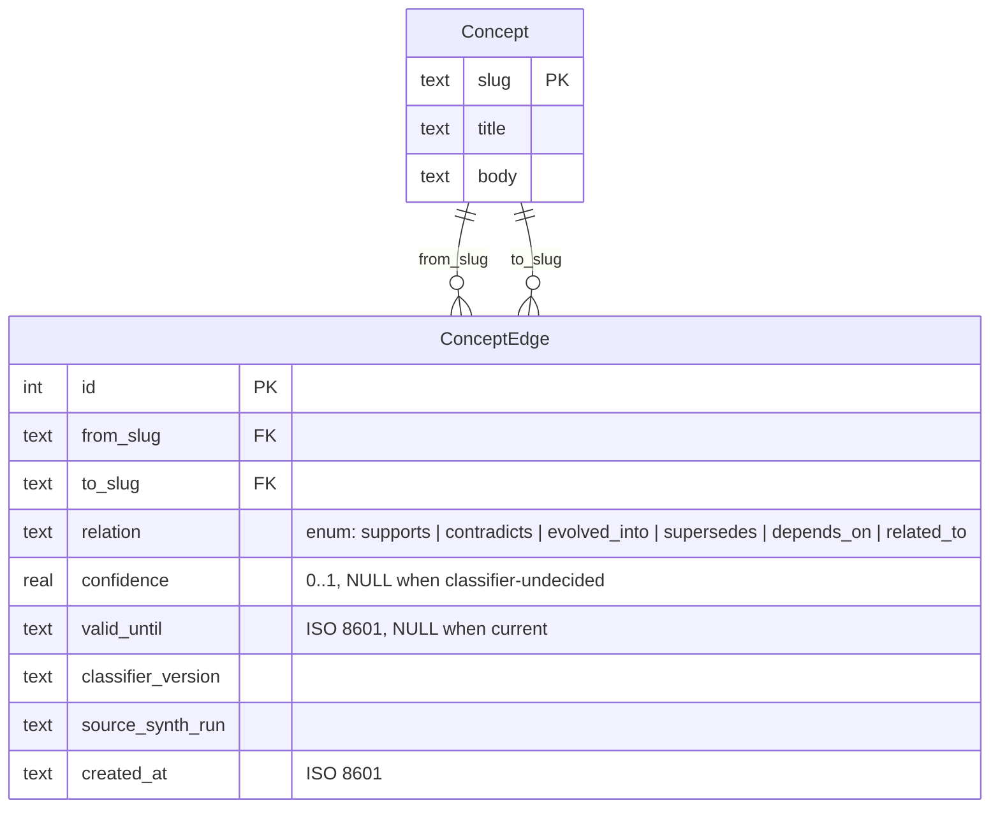

# Vault as Agent Infrastructure

> A long-form companion to [`vault/SCORECARD.md`](../vault/SCORECARD.md). Five tests, four systems, three passes, two honest failures. Telemetry is live from `vault/.vault-index.db` and regenerable via [`scripts/generate_schema.py`](../scripts/generate_schema.py).

## What "agent infrastructure" actually means

The phrase gets used loosely. "I built agent infrastructure" usually decodes to "I plugged some connectors into an LLM." That's tool integration. It's fine. It isn't infrastructure. Infrastructure is the part still standing after the process dies.

Here's the moment the distinction got concrete for me. An overnight agent wrote a concept into my vault, and a second agent — running hours later, in a different process, with no shared memory — read that concept back, found it contradicted something written a week earlier, and wrote a `contradicts` edge between them with a confidence score. No human in the loop. The two agents never ran at the same time. They coordinated entirely through durable, typed, queryable state on disk. That's not a connector talking to an LLM. That's two processes treating a knowledge base the way services treat a database — and it only works because the substrate underneath them passes a specific set of tests.

Nate Jones published a tighter definition of those tests in May 2026: a system is agent infrastructure if it passes five structural checks — **persistent state, defined verbs, ownership, permissions, and queryable audit history**. Durable, named, ownable, permissioned, auditable. Not "connected."

I ran my Obsidian vault against those five tests. Not the vault as I'd like to describe it in an interview — the vault as it exists on disk right now, with the numbers pulled straight from the SQLite index. It passes three tests at a level above Linear, and it loses two of them to Linear cleanly. This document walks each test, links the code that backs the claim, and ends where the two losses point: the next two things I'm building.

The honest version of this argument is the only version worth writing. A scorecard where you win every cell is a sales sheet. A scorecard where you can name exactly where you lose, and why, and what you're shipping to close the gap — that's an architecture you can keep building.

## Section A — Persistent State

**Nate's diagnostic:** *Does the system survive a process crash, machine restart, or session boundary with state intact?*

**The vault's answer: pass, and above Linear.** State lives in three independent substrates, any one of which survives a crash on its own:

1. **Markdown files on disk.** Every concept, connection, and note is a flat file. No database required to read them; no cloud required to own them.
2. **A SQLite index** — `vault/.vault-index.db` — holding 632 typed edges in `concept_edges` and 15,582 retrievable chunks. This is the layer the synthesizer reads from and writes back to.
3. **JSONL session-end flush dumps** via [`agents-sdk/agents/flush.py`](../agents-sdk/agents/flush.py), triggered on SessionEnd and again on PreCompact through [`.claude/hooks/pre-compact-flush.sh`](../.claude/hooks/pre-compact-flush.sh) so state is captured before context auto-compaction can drop it.

The mechanism behind the producer/consumer loop is documented in [`agents-sdk/agents/knowledge_loop/EXPLANATION.md`](../agents-sdk/agents/knowledge_loop/EXPLANATION.md).

**Worked example.** On an offline travel window in mid-May the overnight synthesizer simply didn't run — the laptop was asleep on a train. There was no recovery procedure the next morning because none was needed: every prior concept was still a file on disk, every prior edge was still in SQLite, and resuming was a no-op re-index of whatever changed. A system with persistent state doesn't have a "what happens when it crashes" story. It has a "nothing happens when it crashes" story.

**The comparison.** Notion is cloud-first; its offline mode is partial and there's no local source of truth you own outright — a fail. Default Obsidian survives a crash because markdown is durable, but typed relationships live only inside plugin sidecars, so the *structured* state is fragile — a partial. Linear is Postgres-backed and solid — a clean pass. The vault takes the top mark because it carries three substrates, not one.

## Section B — Defined Verbs

**Nate's diagnostic:** *Are the legal operations on the system explicitly named, ideally enforced?*

**The vault's answer: pass, and above Linear.** There are exactly six legal relations between concepts, and they're enforced at the database level by a `CHECK` constraint — not by convention, not by a linter that runs later, but by SQLite refusing the write:



The enforcement lives in [`agents-sdk/lib/concept_edges.py`](../agents-sdk/lib/concept_edges.py); the design rationale is in [`agents-sdk/lib/concept_edges/EXPLANATION.md`](../agents-sdk/lib/concept_edges/EXPLANATION.md). A rogue verb — `kind_of_relates_to`, `see_also`, whatever an agent hallucinates — never lands, because the insert fails the constraint.

The distribution as of 2026-05-29 is multi-modal, which matters: `depends_on: 215 · related_to: 199 · supports: 160 · contradicts: 38 · evolved_into: 13 · supersedes: 7`. No single verb is doing all the work. The graph distinguishes "A depends on B" from "A supports B" from "A contradicts B," and it uses all six.

**Worked example.** The most interesting verb is `contradicts`, because a knowledge base that can only say "these things are related" can't capture disagreement. On 2026-05-12 the synthesizer wrote `('local-deep-research-ldr', 'gemini-deep-research', 'contradicts', confidence=0.8)` — the moment the local-deep-research citation-quality collapse showed up against Gemini Deep Research's grounding. The graph has a verb for "these two approaches disagree," and it was used, with a confidence score attached. There are 38 such contradiction edges now. The graph holds tension instead of flattening it.

**The comparison.** Notion's "verbs" are app actions (create page, add property), not data-level relations — a fail. Default Obsidian has exactly one implicit verb, the `[[wikilink]]`, which can mean anything — a partial. Linear's issue states and transitions are genuinely defined verbs — a clean pass. The vault takes the top mark for six enforced relations plus the constraint that guards them.

## Section C — Ownership

**Nate's diagnostic:** *Who owns each record, and is that ownership machine-readable?*

**The vault's answer: a partial — and this is the first honest loss.** Ownership today is files on disk, git committer identity, and a frontmatter `author` field where it happens to be present. That's real provenance, but it isn't a per-record ownership *model*. There's no assignee, no watcher, no machine-readable "this concept is owned by this person and these others are subscribed to changes."

> **HONEST NOTE — Linear wins here.** Linear's assignee, creator, and watchers model is semantic and queryable in ways a filesystem isn't. You can ask Linear "what does this person own and who's watching it" and get a structured answer. You can't ask my vault that today.

Naming the gap is the point, because it's the exact argument for the next build. `vault-knowledge-mcp` exposes ownership as a typed edge: a `concept` gets a `created_by` edge pointing at a `person` node, queryable as a graph traversal rather than inferred from `git blame`. That's the first step toward Linear-grade ownership semantics on the axis where the vault currently loses.

## Section D — Permissions

**Nate's diagnostic:** *Can the system grant or deny access per-record, per-role?*

**The vault's answer: another partial — the second honest loss.** Permissions are filesystem-level only: POSIX read/write and whatever the git remote enforces. There is no per-record RBAC, no role that can see concept X but not concept Y.

> **HONEST NOTE — Linear wins here too.** RBAC, team scopes, project-level access. Linear was built multi-tenant; the vault was built single-player. On permissions that architectural difference is decisive.

The closer for this gap isn't a someday — it's already built. The Judge Layer ([`agents-sdk/lib/judge/`](../agents-sdk/lib/judge/__init__.py)) is a Pydantic-typed control-plane interceptor that sits between an agent's intent and its action. An actor emits an `ActionProposal`; a judge evaluates it against a declarative YAML policy; the result is one of four named outcomes — including `JUDGE_UNAVAILABLE`, which turns the control plane's own absence into an observable state rather than a silent exception. Every decision is written to an append-only JSONL ledger the Fleet Observability dashboard reads. It fails open to my manual review, so cadence survives even when the judge model is down. The evaluator runs on a local model at $0 per decision — the cost economics are visible in the bill of materials, not bolted on after.

What that doesn't give me yet is full RBAC — and I'm not going to pretend a control-plane interceptor is the same thing as team scopes and per-record access roles. It isn't. But it's the load-bearing primitive underneath them: "the agent wrote a thing" has already become "the agent proposed a thing, and the control plane evaluated it against a policy before it took effect." The work ahead is implementation — rolling the judge across more of the fleet (it's wired to one agent today, additive policy YAML for the rest) and growing per-agent policy into per-record permission scopes. That's a rollout, not a research project.

## Section E — Queryable Audit History

**Nate's diagnostic:** *Can a third party reconstruct what changed, when, and why, without the human narrating it?*

**The vault's answer: pass, and above Linear.** Three independent audit substrates, each sufficient on its own:

- **`git log`** — semantic commit messages and `v3.X.X` versioning; every vault auto-commit dated and attributable.
- **`concept_edges` SQLite** — every edge stamped with `source_synth_run`, `created_at`, `classifier_version`, and where deprecated, `valid_until`. Eight edges currently carry `valid_until` timestamps, which means the graph is curated in real time, not appended to forever.
- **Synthesizer manifests and daily-log flushes** — `vault/health/*-manifest-*.json` records `concepts_written`, `clusters_sampled`, `rejected_reasons{}`, and `model_used` per run; the daily note carries session-end flush dumps tagged by `trigger:`, surfaced through [`vault/90_system/templates/tpl-daily.md`](../vault/90_system/templates/tpl-daily.md).

**Worked example.** A third party who wants to know what was discovered around the LDR contradiction doesn't need me to narrate it. They run:

```sql
SELECT from_slug, to_slug, relation, source_synth_run, created_at
  FROM concept_edges
 WHERE relation = 'contradicts' AND created_at > '2026-05-12'
 ORDER BY created_at;
```

and the rows come back with the synth-run ID that produced each one. What changed, when, and which automated run is responsible — reconstructable from the data, without me in the room. That's the difference between a notebook and an audit log.

**The comparison.** Notion has per-page version history but weak query over it — a partial. Default Obsidian has nothing beyond what plugins bolt on — a fail. Linear's API plus activity log plus webhooks are good — a clean pass. The vault takes the top mark for three independent substrates you can cross-check against each other.

## Where the vault loses, and why those losses are the blueprints

Final tally: top marks on Persistent State, Defined Verbs, and Audit; partials on Ownership and Permissions. Three passes, two failures.

The two failures aren't shortcomings to apologize for. They're the build map, and they're at different stages:

- **The Permissions gap has its closer already built.** The Judge Layer — control-plane interceptor, typed `ActionProposal`, declarative policy, append-only decision ledger — exists and is tested. It's wired to one agent today; rolling it across the fleet and growing per-agent policy into per-record scopes is implementation work, not invention.
- **The Ownership gap is next up.** `vault-knowledge-mcp` exposes ownership as a typed edge — `created_by` from a concept to a person node — so ownership becomes a graph traversal instead of a `git blame` guess.

An architecture writeup ages badly when the system stops moving. This one is dated on purpose. One of the two closers is already on disk; the other is the next thing I build.

*Three passes, two failures — one closer built, one in flight. That's the shape of an architecture you can keep building, not a position paper.*
