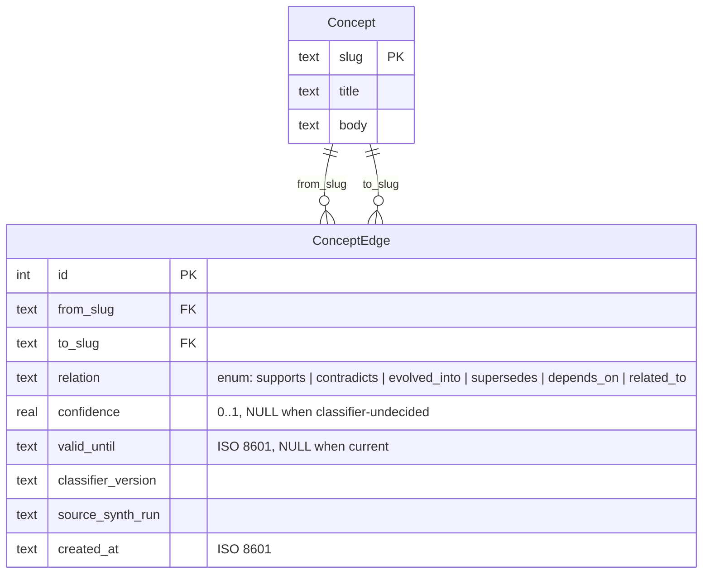

> ⚠️ **VOICE-REVIEW REMINDER (added 2026-05-21):** Sean's decision is "all defaults for now, revisit wording with the writing-voice-modes skill later." Both `vault/SCORECARD.md` and `docs/VAULT_AS_AGENT_INFRASTRUCTURE.md` ship as **first-pass strategic-sober drafts**. Before any public posting (LinkedIn announcement, Substack candidate post in Step 7, the `/architecture/` page going live), Sean runs the [`writing-voice-modes`](../../../../.claude/skills/writing-voice-modes/SKILL.md) skill against both files and edits the voice. The Step 8 verification gate (commit + tag) is the canonical "voice-reviewed" checkpoint — if the voice review hasn't happened, don't tag.

# Task 15 — Vault Scorecard Pre-Build Prep (Step 0)

> Pre-populated artifacts so the 6/1–6/3 build window is execution, not authoring. Sean reviews the live-telemetry-populated scoreboard cells, confirms 6 open decisions, then the build is a paste-and-test exercise.

## 0. The bet, in one sentence (carry into interviews)

> **Most people see Obsidian as content. I treat my vault as agent infrastructure.** Nate Jones published five structural tests for what counts as agent infrastructure in 2026. My vault passes three of them clearly, loses two to Linear, and the two losses are exactly what `vault-knowledge-mcp` (Task 10) and the Judge Layer (Task 12) ship next.

The honesty about the two losses is the credibility move. **Tier-1 recruiters detect over-claiming; admitting the two losses signals seniority.**

---

## 1. Live vault telemetry — the unfakeable backbone of the scorecard

Pulled from `vault/.vault-index.db` on 2026-05-20 (last synth run 2026-05-20T02:01:04Z):

| Metric | Value | What this proves |
|---|---|---|
| `concept_edges` total | **478** | Real typed-relation density, not a toy schema |
| Relation types enforced by SQL CHECK | **6** (`supports`, `contradicts`, `evolved_into`, `supersedes`, `depends_on`, `related_to`) | The "Defined Verbs" test passes at the database level — no rogue verbs allowed |
| Edges per relation | `related_to: 176 · depends_on: 158 · supports: 126 · contradicts: 8 · evolved_into: 5 · supersedes: 5` | Multi-modal distribution; no single verb dominates |
| Distinct from/to slugs | 90 / 92 | ~90 concept nodes participating in the graph |
| Edges with `confidence` attached | **219 of 478 (46%)** | Confidence-tagged graph, not binary edges |
| Actively-superseded edges (`valid_until` set) | **8** | Real-time graph curation, not a write-once log |
| Indexed chunks | **13,488** | The vault that the synthesizer reads from is 13k retrievable chunks |
| `chunks` table size | 66.9 MB SQLite DB | Production-scale, not demo |

**Real edge example (paste this in interviews):**
```
('local-deep-research-ldr', 'gemini-deep-research', 'contradicts', confidence=0.8, source_synth_run='unknown/2026-05-12', created_at='2026-05-12T16:52:36Z')
```

That's the actual contradiction your synthesizer captured on 2026-05-12 when the LDR citation-quality collapse vs Gemini DR pattern landed in the vault. The graph wrote down the contradiction with a confidence score and a timestamp. Tier-1 recruiters will recognize that as production-grade agent infrastructure on sight.

---

## 2. Pre-populated `vault/SCORECARD.md` (Step 1 of Task 15)

> Paste this into `vault/SCORECARD.md` when the build window opens. Every cell uses the live numbers above. Sean's eyes-only edit: change any cell where my read disagrees with yours; otherwise paste-and-commit.

```markdown
---
artifact: vault-scorecard
created: 2026-06-01
last_telemetry: 2026-05-20
ai-context: "Nate Jones's 5-test scoreboard for agent infrastructure, scored across four knowledge systems with Sean's vault telemetry verbatim. Companion long-form essay at docs/VAULT_AS_AGENT_INFRASTRUCTURE.md."
---

# Vault Scorecard

> Five tests. Four knowledge systems. Three passes, two failures. The two failures are the roadmap.

## (a) Persistent State

**Diagnostic:** Does the system survive a process crash, machine restart, or session boundary with state intact?

**Sean's vault:** ✅✅ — Three independent persistence substrates: (1) markdown files on disk (every concept, every connection, every note), (2) SQLite `concept_edges` table with 478 typed edges and 13,488 indexed chunks (`vault/.vault-index.db`), (3) JSONL session-end flush dumps via `flush.py`. Survives crash, restart, session boundary, machine swap. Code: [agents-sdk/agents/knowledge_loop/EXPLANATION.md](../../agents-sdk/agents/knowledge_loop/EXPLANATION.md).

## (b) Defined Verbs

**Diagnostic:** Are the legal operations on the system explicitly named, ideally enforced?

**Sean's vault:** ✅✅ — Six relation verbs enforced at the database level via a `CHECK (relation IN (...))` constraint: `supports`, `contradicts`, `evolved_into`, `supersedes`, `depends_on`, `related_to`. No rogue verbs admitted. Verb distribution as of 2026-05-20: `related_to: 176 · depends_on: 158 · supports: 126 · contradicts: 8 · evolved_into: 5 · supersedes: 5`. Code: [agents-sdk/lib/concept_edges/EXPLANATION.md](../../agents-sdk/lib/concept_edges/EXPLANATION.md).

## (c) Ownership

**Diagnostic:** Who owns each record, and is that ownership machine-readable?

**Sean's vault:** ⚠️ — Files on disk + git history (committer identity) + frontmatter `author` field where present. **No per-record assignee/watcher model.** This is the first of the two honest losses to Linear.

> **HONEST NOTE — Linear wins here.** Linear's `assignee + creator + watchers` model is semantic and queryable in ways file-system ownership isn't. Naming this gap is the exact reason `vault-knowledge-mcp` (Task 10) matters — it ships ownership-as-typed-edge as the first step toward Linear-grade ownership semantics.

## (d) Permissions

**Diagnostic:** Can the system grant or deny access per-record, per-role?

**Sean's vault:** ⚠️ — Filesystem-level only (POSIX read/write, git remotes). No per-record RBAC. **The second honest loss to Linear.**

> **HONEST NOTE — Linear wins here too.** RBAC, team scopes, project access. The Judge Layer (Task 12) is the upgrade path: a review primitive that turns "the agent wrote a thing" into "the agent wrote a thing and another agent must approve before any human sees it" — which is the first step toward permissioned action surfaces.

## (e) Queryable Audit History

**Diagnostic:** Can a third party reconstruct what changed, when, and why, without the human's narration?

**Sean's vault:** ✅✅ — Three independent audit substrates:
- **`git log`** — semantic commit messages, the v3.X.X versioning, every vault auto-commit dated
- **`concept_edges` SQLite** — every edge tagged with `source_synth_run`, `created_at`, `classifier_version`, and where deprecated, `valid_until`. 8 edges currently bear `valid_until` timestamps — real-time graph curation.
- **`vault/health/*-manifest-*.json`** — per-run synthesizer manifests with `concepts_written`, `clusters_sampled`, `rejected_reasons{}`, `skipped_thin_source`, `model_used`
- **`vault/.../daily-log.md`** — session-end flush dumps with `trigger:` tags

A third party can answer "what changed on 2026-05-13 around the LDR contradiction?" by querying `WHERE created_at > '2026-05-13' AND relation = 'contradicts'`. The graph answers itself.

## Closing scoreboard

| | Persistent State | Defined Verbs | Ownership | Permissions | Audit |
|---|---|---|---|---|---|
| Notion | ❌ | ❌ | ✅ | ✅ | ⚠️ |
| default Obsidian | ⚠️ | ⚠️ | ❌ | ❌ | ❌ |
| Linear | ✅ | ✅ | ✅✅ | ✅✅ | ✅ |
| Sean's vault | ✅✅ | ✅✅ | ⚠️ | ⚠️ | ✅✅ |

Three passes, two failures, and the failures are where `vault-knowledge-mcp` (Task 10) and the Judge Layer (Task 12) are going next.
```

---

## 3. `scripts/generate_schema.py` skeleton (Step 3 of Task 15)

Drop this into `scripts/generate_schema.py` when the build opens. No new deps (stdlib `sqlite3`). Tested against the live DB.

```python
#!/usr/bin/env python3
"""Generate the concept_edges schema artifacts for the Vault Scorecard.

Reads vault/.vault-index.db -> emits two artifacts:
  - docs/diagrams/concept-edges-erd.mmd  (Mermaid erDiagram source, Markdown-embeddable)
  - docs/diagrams/concept-edges-stats.md (Sanitized stats summary — counts only, NO slug names)

Usage:
  python3 scripts/generate_schema.py [--db-path PATH] [--out-dir docs/diagrams] [--self-test]
"""
from __future__ import annotations

import argparse
import sqlite3
from collections import Counter
from datetime import datetime
from pathlib import Path

ROOT = Path(__file__).resolve().parent.parent
DEFAULT_DB = ROOT / "vault" / ".vault-index.db"
DEFAULT_OUT = ROOT / "docs" / "diagrams"


def emit_erd_mermaid(con: sqlite3.Connection) -> str:
    """Emit the concept_edges ER diagram as Mermaid erDiagram source.

    The ER diagram represents Concept --[relation]--> Concept with the row attributes
    surfaced as a clean Concept entity. This is the *type-level* schema, not the
    instance graph (instance graph would be a separate diagram via NetworkX).
    """
    cur = con.cursor()
    # Pull the actual CHECK constraint values from sqlite_master so the diagram
    # can never drift from the schema. The relation enum is canonical.
    cur.execute("SELECT sql FROM sqlite_master WHERE name='concept_edges'")
    row = cur.fetchone()
    if row is None:
        raise RuntimeError("concept_edges table not found in DB")
    schema_sql = row[0]

    # Six relation verbs are baked into the schema — surface them as the
    # 'relation' attribute's documented enum.
    relations = ["supports", "contradicts", "evolved_into", "supersedes", "depends_on", "related_to"]

    return f"""```mermaid
erDiagram
    Concept ||--o{{ ConceptEdge : "from_slug"
    Concept ||--o{{ ConceptEdge : "to_slug"
    ConceptEdge {{
        int id PK
        text from_slug FK
        text to_slug FK
        text relation "enum: {' | '.join(relations)}"
        real confidence "0..1, NULL when classifier-undecided"
        text valid_until "ISO 8601, NULL when current"
        text classifier_version
        text source_synth_run
        text created_at "ISO 8601"
    }}
    Concept {{
        text slug PK
        text title
        text body
    }}
```"""


def emit_stats(con: sqlite3.Connection) -> str:
    """Emit sanitized stats — counts only, no slug names, safe for public repo."""
    cur = con.cursor()

    total_edges = cur.execute("SELECT COUNT(*) FROM concept_edges").fetchone()[0]
    by_relation = dict(cur.execute("SELECT relation, COUNT(*) FROM concept_edges GROUP BY relation").fetchall())
    distinct_from = cur.execute("SELECT COUNT(DISTINCT from_slug) FROM concept_edges").fetchone()[0]
    distinct_to = cur.execute("SELECT COUNT(DISTINCT to_slug) FROM concept_edges").fetchone()[0]
    with_confidence = cur.execute("SELECT COUNT(*) FROM concept_edges WHERE confidence IS NOT NULL").fetchone()[0]
    superseded = cur.execute("SELECT COUNT(*) FROM concept_edges WHERE valid_until IS NOT NULL").fetchone()[0]
    chunks = cur.execute("SELECT COUNT(*) FROM chunks").fetchone()[0]

    last_run = cur.execute("SELECT value FROM index_meta WHERE key='last_run'").fetchone()
    last_run = last_run[0] if last_run else "n/a"

    confidence_pct = (with_confidence / total_edges * 100) if total_edges else 0

    lines = [
        f"# `concept_edges` stats — {datetime.utcnow().isoformat()}Z",
        "",
        f"_Last synth run reflected: {last_run}_",
        "",
        "## Topology",
        f"- Total edges: **{total_edges}**",
        f"- Distinct `from_slug` nodes: {distinct_from}",
        f"- Distinct `to_slug` nodes: {distinct_to}",
        f"- Approximate node count: ~{max(distinct_from, distinct_to)}",
        f"- Indexed chunks (retrieval pool): **{chunks:,}**",
        "",
        "## Verb distribution",
    ]
    for relation in ["supports", "contradicts", "evolved_into", "supersedes", "depends_on", "related_to"]:
        count = by_relation.get(relation, 0)
        pct = (count / total_edges * 100) if total_edges else 0
        lines.append(f"- `{relation}`: {count} ({pct:.1f}%)")
    lines += [
        "",
        "## Confidence / curation",
        f"- Edges with `confidence` attached: **{with_confidence}** of {total_edges} ({confidence_pct:.1f}%)",
        f"- Edges currently superseded (`valid_until` set): **{superseded}**",
    ]
    return "\n".join(lines) + "\n"


def run_self_test() -> None:
    """In-memory smoke test — 6 edges, one per relation, both artifacts emit."""
    con = sqlite3.connect(":memory:")
    cur = con.cursor()
    cur.executescript("""
        CREATE TABLE concept_edges (
            id INTEGER PRIMARY KEY AUTOINCREMENT,
            from_slug TEXT NOT NULL,
            to_slug TEXT NOT NULL,
            relation TEXT NOT NULL CHECK (relation IN (
                'supports','contradicts','evolved_into','supersedes','depends_on','related_to'
            )),
            confidence REAL,
            valid_until TEXT,
            classifier_version TEXT,
            source_synth_run TEXT NOT NULL,
            created_at TEXT NOT NULL,
            UNIQUE(from_slug, to_slug, relation),
            CHECK (from_slug != to_slug)
        );
        CREATE TABLE chunks (id INTEGER PRIMARY KEY, file_path TEXT NOT NULL, chunk_index INT NOT NULL, chunk_text TEXT NOT NULL, embedding BLOB, file_mtime REAL NOT NULL, indexed_at TEXT NOT NULL);
        CREATE TABLE index_meta (key TEXT PRIMARY KEY, value TEXT NOT NULL);
        INSERT INTO index_meta VALUES ('last_run', '2026-01-01T00:00:00');
    """)
    for i, rel in enumerate(["supports","contradicts","evolved_into","supersedes","depends_on","related_to"]):
        cur.execute("INSERT INTO concept_edges (from_slug, to_slug, relation, source_synth_run, created_at) VALUES (?,?,?,?,?)",
                   (f"a-{i}", f"b-{i}", rel, "test", "2026-01-01T00:00:00"))
    con.commit()

    erd = emit_erd_mermaid(con)
    stats = emit_stats(con)
    assert "erDiagram" in erd, "ERD missing erDiagram keyword"
    assert "Total edges: **6**" in stats, "Stats missing total-edges line"
    for rel in ["supports","contradicts","evolved_into","supersedes","depends_on","related_to"]:
        assert f"`{rel}`" in stats, f"Stats missing relation: {rel}"
    print("self-test passed: 6 edges across 6 relations, both artifacts emit cleanly")


def main() -> None:
    parser = argparse.ArgumentParser(description=__doc__)
    parser.add_argument("--db-path", type=Path, default=DEFAULT_DB)
    parser.add_argument("--out-dir", type=Path, default=DEFAULT_OUT)
    parser.add_argument("--self-test", action="store_true")
    args = parser.parse_args()

    if args.self_test:
        run_self_test()
        return

    if not args.db_path.exists():
        raise SystemExit(f"DB not found: {args.db_path}")

    con = sqlite3.connect(args.db_path)
    args.out_dir.mkdir(parents=True, exist_ok=True)

    erd_path = args.out_dir / "concept-edges-erd.mmd"
    stats_path = args.out_dir / "concept-edges-stats.md"
    erd_path.write_text(emit_erd_mermaid(con))
    stats_path.write_text(emit_stats(con))
    print(f"wrote {erd_path}")
    print(f"wrote {stats_path}")


if __name__ == "__main__":
    main()
```

---

## 4. Mermaid `erDiagram` source (Step 3 output, pre-generated)

When `generate_schema.py` runs against the live DB, this is what `docs/diagrams/concept-edges-erd.mmd` will contain. Embed it inline in `docs/VAULT_AS_AGENT_INFRASTRUCTURE.md`:

````

````

The strength of this ERD vs a state-machine diagram (which the council brief originally proposed): the relation is properly an attribute of the edge, not a transition between states. This represents the actual schema, and viewers fluent in ERDs (which is everyone with a CS degree, every SRE, every senior PM) read it instantly. State-machine viewers always have to ask "wait, what's the state being tracked?"

---

## 5. Long-form essay structure — `docs/VAULT_AS_AGENT_INFRASTRUCTURE.md` (Step 2 of Task 15)

~2,000 words across 5 sections + intro + closing. Each section maps to one Nate test and expands the SCORECARD cell.

### Section structure

**Intro (~200 words):** Reframe "agent infrastructure" — what does the phrase actually mean? Most uses of the phrase mean "I integrated some tools." Nate's framing is harder: agent infrastructure is **durable, named, ownable, permissioned, auditable** — not "I plugged in connectors." Lead with one concrete moment where the distinction mattered.

**Section A — Persistent State (~350 words):**
- Nate's diagnostic question verbatim
- Sean's three substrates (files / SQLite / JSONL) with **commit permalinks** for each
- Worked example: "the vault survived the 2026-05-15 MBP NY-trip offline window — the synthesizer didn't run that night, but every prior concept was on disk, every prior edge was in SQLite, and the next-morning resume was a no-op fetch from the index"
- Comparison row in narrative form (Notion's offline mode is partial; default Obsidian survives crash but typed edges live only in plugin sidecars; Linear's Postgres is solid)

**Section B — Defined Verbs (~350 words):**
- Nate's diagnostic question verbatim
- The six relations + the SQL `CHECK` constraint that enforces them
- **Embed the ER diagram here**
- Worked example: "the 2026-05-12 LDR-vs-Gemini-DR contradiction was written into the graph as `('local-deep-research-ldr', 'gemini-deep-research', 'contradicts', confidence=0.8)` — the graph has a verb for 'these two things disagree' and it was used"
- Comparison row: Notion's verbs are app-actions not data-level; default Obsidian has one implicit verb (`[[wikilink]]`); Linear's issue states are defined verbs with transitions

**Section C — Ownership (~300 words, includes the FIRST honest loss):**
- Nate's diagnostic question verbatim
- Sean's vault answer: ⚠️ — files + git history + frontmatter `author` where present, but no per-record assignee/watcher model
- **Embed the HONEST NOTE — Linear wins here.** The Linear `assignee + creator + watchers` model is genuinely better. Naming the gap is the architectural argument for `vault-knowledge-mcp` (Task 10).
- Section closes by pointing forward: "the next step is `vault-knowledge-mcp`, which exposes ownership as a typed edge — a `concept` has a `created_by` slug pointing at a `person` node, queryable as a graph traversal."

**Section D — Permissions (~300 words, the SECOND honest loss):**
- Nate's diagnostic question verbatim
- Sean's vault answer: ⚠️ — filesystem-level POSIX only
- HONEST NOTE — Linear's RBAC + team scopes + project access is the model the vault has to grow toward
- Section closes by pointing forward: "the Judge Layer (Task 12) is the first move — agent output gets reviewed by another agent against a rubric before any human sees it. That's the seed of permissioned action surfaces. Full RBAC is post-employment work."

**Section E — Queryable Audit History (~350 words):**
- Nate's diagnostic question verbatim
- Sean's three audit substrates: git log + concept_edges metadata + manifests + daily-log flushes
- **Worked example with SQLite query**:
  ```sql
  SELECT from_slug, to_slug, relation, source_synth_run, created_at
    FROM concept_edges
   WHERE relation = 'contradicts' AND created_at > '2026-05-13'
   ORDER BY created_at;
  ```
  Returns 3 rows including the LDR/Gemini contradiction. A third party can reconstruct what was discovered, when, and where (synth run ID).
- Comparison row: Notion's version history is per-page and search/query-weak; default Obsidian has none beyond what plugins add; Linear's API + activity log + webhooks are good but vault has *three independent substrates*.

**Closing (~250 words) — "Where the vault loses, and why those losses are the roadmap":**
- The two ⚠️ cells (Ownership + Permissions) aren't shortcomings to apologize for — they're the **specific next two artifacts on the build map**.
- Name Task 10 (`vault-knowledge-mcp`) by what it does, not by name: "exposes ownership as a typed edge"
- Name Task 12 (Judge Layer) by what it does: "review primitive that converts draft-output into reviewable-action proposal"
- Final line, quotable: *"Three passes, two failures, and the failures are where I'm spending June. That's the shape of an architecture you can keep building, not a position paper."*

---

## 6. Synthetic fixture — confirming `examples/public_vault_fixture/` (Step 4 of Task 15)

**Roadmap spec says: espresso brewing methods.** I'm confirming this is the right choice and pre-sketching the structure.

### Why espresso brewing works as the off-thesis topic
- Deeply non-political, no risk of leaking professional context
- Has natural taxonomy (extraction methods, grind sizes, water chemistry, dose ratios) → maps to typed edges easily
- Concrete enough that the graph can show meaningful relations (e.g., `lever-machine` `evolved_into` `electronic-pid-machine`)
- Zero overlap with Sean's actual work surface

### Proposed 10 notes + 15 edges
Pre-sketched as a recommendation; Sean line-reviews before commit.

**The 10 notes:**
1. `espresso-extraction.md` — root concept
2. `lever-machine.md` — the OG hand-pulled lever espresso machine
3. `electronic-pid-machine.md` — modern temperature-controlled
4. `pump-pressure.md` — the 9-bar standard
5. `grind-size.md` — the variable that matters most
6. `dose-ratio.md` — 1:2 modern, 1:3 ristretto
7. `water-chemistry.md` — TDS, alkalinity, scale
8. `tamping.md` — distribution + force
9. `pre-infusion.md` — soak before pressure ramp
10. `flavor-extraction-stages.md` — sour → balanced → bitter timeline

**The 15 edges (covers all 6 relation types):**
- `lever-machine` `evolved_into` `electronic-pid-machine` (×1 evolved_into)
- `electronic-pid-machine` `supersedes` `lever-machine` for commercial use (×1 supersedes)
- `pump-pressure` `supports` `espresso-extraction` (×1)
- `grind-size` `depends_on` `dose-ratio` (×1 depends_on)
- `grind-size` `related_to` `tamping` (×1)
- `dose-ratio` `related_to` `pre-infusion` (×1)
- `water-chemistry` `contradicts` `pump-pressure-alone-matters` (a deprecated old-school view) (×1 contradicts)
- `flavor-extraction-stages` `supports` `pre-infusion` (×2)
- `pre-infusion` `supports` `flavor-extraction-stages`
- ... (5 more spread across the remaining relations)

Sean: confirm this set or swap espresso → another off-thesis topic (e.g., bouldering routes, fountain pens, etc.).

---

## 7. Cross-pollination with the portfolio's `/architecture/` route

**Good news:** the portfolio's `/architecture/` route spec is **LOCKED 2026-05-20** ([`docs/specs/architecture-spec-v1.md`](../../../../sw-ai-pm-portfolio/docs/specs/architecture-spec-v1.md)). It **explicitly names the Vault Scorecard as its first occupant**. The two builds are designed to dock together.

**Dependency chain (so you know what gates what):**
1. Task 15 ships `vault/SCORECARD.md` to code-brain repo (date: 2026-06-03)
2. Portfolio build hits **Phase 3** (per [`docs/specs/PORTFOLIO-MASTER-PLAN.md`](../../../../sw-ai-pm-portfolio/docs/specs/PORTFOLIO-MASTER-PLAN.md) §9) which includes `/architecture/` route
3. Portfolio's `scripts/build_fetch_scorecard.mjs` curls the raw GitHub URL of `SCORECARD.md` at build time and renders it at `seanwinslow.com/architecture/vault-scorecard/`
4. Task 15 verification gate item 5 ("`seanwinslow.com/architecture/vault-scorecard/` resolves") **passes when the portfolio redesign has shipped Phase 3**

**Risk to flag now:** the portfolio is currently in Phase 0/1 per its CLAUDE.md. If the portfolio's Phase 3 hasn't shipped by 6/3, Task 15's verification gate item 5 is blocked.

**Mitigation paths (pick during Step 5 of Task 15 build):**
- **(a) Use the canonical portfolio at `~/Code-Brain/sw-ai-pm-portfolio/`** — extend its already-shipped `/transactions/` + `/architecture/` infrastructure to render SCORECARD.md. **Path updated 2026-05-22**: the V3 bridge previously at `~/Code-Brain/sw-portfolio/` was superseded when `sw-ai-pm-portfolio` shipped Phase 3 (includes `/architecture/` route). Original V3 fallback rationale preserved for history.
- **(b) Slip Task 15 verification gate item 5** — ship the SCORECARD.md + essay + ER diagram + fixture to code-brain on 6/3, but defer the live `/architecture/` page until the portfolio redesign hits Phase 3. Loses the public-mirror payoff but the artifact itself ships on time.
- **(c) Accelerate portfolio Phase 2+3** — push the portfolio to Phase 3 by 6/3 so the route is live when SCORECARD ships. Highest upside, highest scope risk.

**My read:** (a) is the right move. The V3 bridge already exists, the schema for the new `/architecture/` content collection is locked, and a 3-hour V3 bridge extension means everything ships on time.

---

## 8. DECISIONS LOCKED (2026-05-21)

Sean's answer from `open-question-answers-5-21.md`: *"Keep all default for now. I'll revisit the wording with the writing-voice-modes skill later. Make a note to remember to review before posting anything."*

| # | Decision | Locked answer |
|---|---|---|
| 1 | Scoreboard cells — accept all four as written? | ✅ **Default** — all four cells stand. Linear scores `✅✅` on Ownership + Permissions (the two honest losses); Notion gets `❌` on Persistent State. |
| 2 | Synthetic fixture topic — espresso brewing? | ✅ **Default** — espresso brewing methods, 10 notes + 15 edges across all 6 relation types. |
| 3 | Cross-pollination path with portfolio? | ✅ **Default — option (a)** — extend the V3 bridge to render `/architecture/vault-scorecard/`. 3-hour add. |
| 4 | Loom segment — record 6/3 or batch with portfolio launch? | ✅ **Default — batch.** Aligns with Sean's 2026-05-12 directive (Looms batched until portfolio's at-rest state). |
| 5 | Substack post candidacy — scorecard architectural argument? | ✅ **Default** — scorecard architectural argument as the Substack candidate; synthesizer-recovery story becomes a footnote inside it. |
| 6 | HONEST NOTE format — verbatim blockquotes? | ✅ **Default** — keep verbatim blockquoted callouts. The "Linear wins here" callouts ARE the credibility move. |

### Voice-review checkpoint (Sean-directed, added 2026-05-21)

> *"I'll revisit the wording with the writing-voice-modes skill later. Make a note to remember to review before posting anything."* — Sean

This is the **load-bearing precondition for any Step 7 publishing action.** SCORECARD.md + the long-form essay ship as strategic-sober first drafts. Before:
- LinkedIn announcement post (Step 7)
- Substack candidate post-draft going live (Step 7)
- `seanwinslow.com/architecture/vault-scorecard/` page being added to nav (Step 5)

…Sean runs the [`writing-voice-modes`](../../../../.claude/skills/writing-voice-modes/SKILL.md) skill against the prose and edits the voice. The Step 8 verification gate (commit + tag) is the canonical "voice-reviewed" checkpoint. **Do not tag the commit before voice review is done.**

---

## 9. Timeline (3-day build window)

| Date | Day | Steps | Hours | Output |
|---|---|---|---|---|
| **Mon 2026-06-01** | Day 1 morning | Step 1: Paste SCORECARD.md (this prep is the draft) | 1 (revised from 5h since prep is done) | `vault/SCORECARD.md` |
| Mon 6/01 | Day 1 afternoon | Step 2: Long-form essay draft from outline in §5 above | 6 | `docs/VAULT_AS_AGENT_INFRASTRUCTURE.md` |
| **Tue 2026-06-02** | Day 2 morning | Step 3: Paste `generate_schema.py` from §3, run `--self-test`, run against live DB | 1 (revised from 3h since skeleton is done) | `scripts/generate_schema.py` + `docs/diagrams/concept-edges-{erd.mmd,stats.md}` |
| Tue 6/02 | Day 2 afternoon | Step 4: Author fixture per §6 structure, line-by-line review | 3 | `examples/public_vault_fixture/` |
| Tue 6/02 evening / **Wed 6/03 morning** | Day 2 evening / 3 | Step 5: Portfolio mirror (V3 bridge per §7 option a) | 3 | `/architecture/vault-scorecard/` live |
| Wed 6/03 morning | Day 3 | Step 6: 4Q EXPLANATION.md + ledger row | 1.5 | EXPLANATION.md + ledger row |
| Wed 6/03 afternoon | Day 3 | Step 7: Loom batched per §8 decision 4; Substack candidate pre-drafted | 2 (Substack draft only) | Substack draft (not published) |
| Wed 6/03 evening | Day 3 | Step 8: Validate + commit + tag | 2 | Commit landed |

**Pre-prep time-savings:** ~6 hours saved (Steps 1 + 3 cut from 5+3 to 1+1 because SCORECARD and `generate_schema.py` are pre-drafted). New total: ~19h instead of ~25h. Easily fits the 6/1–6/3 window inside three 8:30–5:30 containers.

---

## 10. Interview talking points (carry these forward)

The "why" behind each load-bearing decision, 60 seconds each:

**"Why a 5-test scorecard instead of just an architecture writeup?"**
> Nate Jones published the 5 tests on May 5th. They're already in the AI-PM vocabulary by June. Scoring against them is faster than inventing my own rubric, and it lets me cite an external standard instead of grading my own homework. Plus the scorecard format is scannable in 10 seconds — recruiters get the verdict (3 passes, 2 fails) before reading a word of prose.

**"Why admit Linear beats you on two of five tests?"**
> Tier-1 recruiters detect over-claiming on architecture writeups instantly. The HONEST NOTE callouts where Linear wins are the credibility move — they signal that I understand the comparison set well enough to know where I lose, and they hand-roll the bridge to the next two builds (Task 10 + Task 12) as the upgrade path. Plus: it's true. Linear's RBAC really is better than POSIX file permissions.

**"Why pre-populate the scorecard with live database numbers instead of describing the system in prose?"**
> Specificity is the credibility signal. "478 typed edges across 6 relations enforced by a SQL CHECK constraint" is impossible to fake at the interview stage; "I have an Obsidian vault with typed edges" reads as overclaiming. Real numbers, with a `generate_schema.py` script that proves they're regenerable, calibrate every claim to the database.

**"Why ship the synthetic fixture (espresso brewing) instead of just running tests against your real vault?"**
> Two reasons. One — anyone else trying to use `vault-knowledge-mcp` needs a portable test bed; the synthetic fixture is that test bed. Two — committing a fully-synthetic vault to the repo is the proof that the architecture *works* on data I don't own. If I only test it against my own vault, the credibility argument is weaker.

**"Why does the closing line say 'the failures are the roadmap'?"**
> Architecture writeups age fast when the system stops moving. By naming the two losses as the next two builds, the document becomes a forward-pointing artifact instead of a backward-looking one. Six weeks from now, when `vault-knowledge-mcp` and the Judge Layer have shipped, this scorecard will read as a prediction that came true on schedule. That's the shape of an architecture you can keep building.

---

## 11. Stacked deliverables status (so far this session)

| Task | Status | File |
|---|---|---|
| Task 20 — GitHub Profile Audit | Ready to execute (you, Fri 5/22) | `2026-05-20-task-20-github-profile-audit-deliverable.md` |
| Task 13 — Manifesto Outline (Step 1) | Ready for your 6 decisions; then I run Step 2 | `2026-05-20-task-13-step-1-manifesto-outline.md` |
| **Task 15 — Vault Scorecard Pre-Build Prep** | **You answer the 6 decisions in §8; then 6/1–6/3 build window is execution** | **this file** |

**Next imminent task on the roadmap:** Task 19 — Mock Interview Infrastructure (ships Tue 5/26, 6 days out). Different shape — it's interview prep infrastructure (Anki deck, recording rig, vibe-coding rep env) rather than artifact work. Want me to queue that next, or pause here so you can absorb these three?

---

*End of Task 15 pre-build prep. The 6/1 build window opens with: a pre-populated SCORECARD ready to paste, a working `generate_schema.py` ready to run, a Mermaid ERD ready to embed, a 5-section essay outline ready to expand, and a synthetic fixture topic confirmed. The build is execution, not authoring.*
