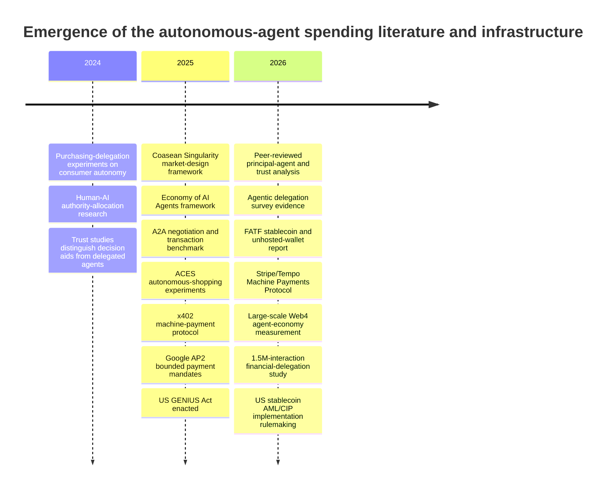
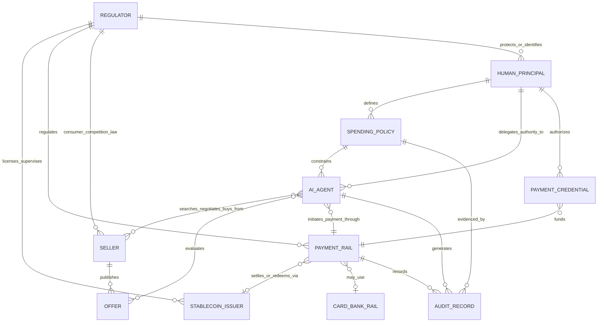

# Autonomous AI Agent Spending: Economics, Pricing, Trust, and Stablecoin Regulation, 2024–2026

## Executive summary

The 2024–2026 literature on autonomous AI spending is real but still thin. The strongest scholarship does **not yet amount to a mature “economics of agent payments” field**. Instead, it is forming at the intersection of principal-agent theory, human-AI delegation, market design, algorithmic consumer behavior, payment-protocol engineering, and virtual-asset regulation. The clearest economic framing comes from Shahidi, Rusak, Manning, Fradkin, and Horton’s *The Coasean Singularity?*, which argues that autonomous agents can reduce search, communication, contracting, and identity-verification costs enough to change market structure; Hadfield and Koh similarly analyze AI agents as economic actors whose decisions can alter price signals and equilibrium behavior. Both are working-paper/chapter-level contributions rather than mature empirical literatures. citeturn6search0turn11search0

**Human control and principal-agent trust.** Peer-reviewed work strongly suggests that willingness to delegate falls when people perceive loss of choice or decision autonomy, particularly for consequential decisions. Purchasing experiments by Husairi and Rossi find that removing perceived choice and decision autonomy depresses adoption of AI purchasing delegation; Adam et al. directly study user- versus technology-initiated delegation; Pathak and Bansal study trust in AI used as a decision aid versus delegated agent. A 2026 survey of 407 experienced AI users found relatively low intended delegation for financial decision-making, and a 2026 preprint analyzing 1.5 million real ChatGPT/Gemini interactions finds actual delegation of financial **execution** remains rare even though AI is widely used to inform financial judgment. citeturn17search0turn17search1turn17search2turn16search9turn19search9 The emerging architecture therefore looks less like “give the AI a credit card” and more like **bounded delegation**: budgets, category restrictions, counterparties, timing rules, per-transaction ceilings, escalation thresholds, and auditable mandates. Google’s AP2 protocol makes exactly this distinction between user-signed intent mandates and transaction/cart mandates, although AP2 is an industry protocol, not independent evidence that these controls are optimal. citeturn22view0turn22view1

**Pricing.** There is no independent academic dataset establishing whether flat-rate/bundled or per-use pricing currently predominates specifically for **services purchased by software agents**. That absence is important. What can be said is more nuanced. For *AI-agent products sold to enterprises*, a 2026 Simon-Kucher vendor analysis reports seat-based pricing at 41%, fixed-fee at 30%, usage-based at 23%, and outcome-based at 7%—so conventional flat/seat structures still dominate that adjacent market. citeturn23view1 By contrast, the new protocols explicitly designed for machine buyers lean strongly toward metering: x402 makes payment for an HTTP/API request a native operation, while Stripe/Tempo’s Machine Payments Protocol supports both microtransactions and recurring payments. Thus, **per-use metering is the emerging protocol default for machine-consumed APIs, but it is not yet defensible to call it the prevailing economy-wide business model**. citeturn22view2turn22view3

**Seller-side bundling.** This is the largest theoretical hole. In the 2024–2026 literature reviewed here, I found **no peer-reviewed paper, and no convincing recent working paper, deriving a seller-side pure/mixed bundling equilibrium specifically when the buyers are autonomous LLM-based purchasing agents**. There is older formal work on software agents and information bundling, but the directly relevant literature predates the current agentic-AI wave by roughly two decades. citeturn21search2turn21search5 Current work instead studies neighboring questions: AI-induced transaction-cost reductions, strategic buying, seller optimization against AI shoppers, demand concentration, agent-to-agent bargaining, and potential distortions or collusion. citeturn6search0turn16search10turn19search21turn11search24 This makes agent-facing bundle design an unusually clean research opportunity.

**Stablecoin regulation.** Existing law overwhelmingly regulates the **human/legal principal, issuer, wallet provider, CASP/VASP, seller, or payment intermediary—not the AI agent as an independent regulated economic person**. FATF’s 2026 work treats stablecoins within Recommendation 15 and emphasizes VASPs, financial institutions, stablecoin issuers, unhosted-wallet risks, licensing, risk assessment, and the Travel Rule. citeturn22view5turn22view6 In the United States, the 2025 GENIUS Act creates an issuer framework and treats permitted payment-stablecoin issuers as financial institutions for Bank Secrecy Act purposes; 2026 FinCEN rulemaking proposes AML/CFT and customer-identification requirements. citeturn15search20turn15search17 In the EU, MiCA gives holders of e-money tokens claims and redemption rights against issuers, while EBA has addressed overlap between MiCA and PSD2 for e-money-token payment services. citeturn15search14turn15search3turn15search7

The crucial consumer-protection distinction is that **stablecoin redemption is not the same thing as reversing a purchase**. A token holder may have an at-par claim against an issuer while still lacking a card-style automatic chargeback for an agent-authorized blockchain payment to a merchant. Whether a mistaken agent payment can be recovered instead turns on mandate/authorization law, merchant refund mechanisms, escrow or protocol design, issuer capabilities, and applicable consumer/payment law. This is an inference from the current frameworks; there is not yet a dedicated body of case law on mistaken autonomous-agent stablecoin spending. citeturn15search1turn15search14turn15search3

| Question | Best-supported conclusion as of 2026 |
|---|---|
| How will people trust agents with money? | Through **bounded authority rather than unrestricted autonomy**: limits, scopes, signed mandates, approval thresholds, observability, and post-hoc audit. Academic evidence supports the importance of retained autonomy; protocol designs operationalize it. citeturn17search0turn18view3turn22view0 |
| Flat rate or metering? | **Unknown at market level.** Flat/seat pricing still dominates adjacent enterprise-agent products; machine-payment protocols increasingly make per-call/per-session metering natural. citeturn23view1turn22view2turn22view3 |
| Do we know the equilibrium bundle strategy against agent buyers? | **No.** Current 2024–2026 literature does not yet provide a formal agent-buyer bundling equilibrium. |
| Are autonomous stablecoin payments outside AML rules? | **No.** Existing AML duties attach to issuers, VASPs/CASPs and other regulated intermediaries and to identification of their underlying customers/controllers. citeturn22view5turn15search20 |
| Does blockchain finality eliminate consumer remedies? | **No, but it changes their location.** There may be redemption, merchant refunds, issuer intervention or legal remedies, but not necessarily a native card-like transaction reversal. citeturn15search14turn15search1 |

## Evidence base and timeline

The evidence quality is highly uneven. The most useful distinction is between **peer-reviewed behavioral evidence**, **economic and computer-science preprints**, **vendor/protocol evidence**, and **regulation**. Vendor documents are unusually important here because payment infrastructure is developing faster than the academic publication cycle, but they should not be mistaken for evidence of market-wide adoption or welfare effects. citeturn22view0turn22view2turn22view3

| Study/source | Status | Evidence | Main contribution to agent-spending economics | Principal limitation |
|---|---|---|---|---|
| Ahmad Husairi & Rossi, *Decision Support Systems* (2024) | **Peer-reviewed; experimental** | Three purchasing-delegation experiments | Choice and decision autonomy materially affect willingness to delegate purchases to AI. citeturn17search0turn17search4 | Delegated choice, not a deployed autonomous payment agent using real money. |
| Adam, Diebel, Goutier & Benlian, *Decision Support Systems* (2024) | **Peer-reviewed; empirical** | Human-AI task-allocation studies | Directly addresses the tension between user-invoked and technology-invoked delegation and perceived control. citeturn17search1turn17search5 | General task delegation rather than spending policy. |
| Pathak & Bansal, *Computers in Human Behavior: Artificial Humans* (2024) | **Peer-reviewed; empirical** | Adoption/trust analysis | Distinguishes AI as decision aid from AI as delegated agent and makes trust central to adoption. citeturn17search2turn17search13 | Adoption intentions rather than autonomous transaction records. |
| Ismagilova & Ploner, *Computers in Human Behavior: Artificial Humans* (2025) | **Peer-reviewed; experiment** | Principal delegates risky financial choice to human/algorithmic decision process | Shows that delegated financial decision-making and subsequent evaluation/accountability are behaviorally non-neutral. citeturn19search0turn19search4 | Financial risk choice, not shopping/payment execution. |
| McDavid, Kiesling & Chassin, *Review of Austrian Economics* (2026) | **Peer-reviewed; conceptual/case analysis** | Principal-agent/trust model applied to transactive energy | Most explicit recent scholarly treatment of AI agents as market agents whose principals retain responsibility while surrendering moment-to-moment control. citeturn18view3 | Primarily theoretical; transactive-energy case is not general consumer commerce. |
| Hasselwander, *AI & Society* (2026) | **Peer-reviewed; survey** | 407 experienced AI users in the Philippines | Finds heterogeneous delegation preferences and relatively low willingness to delegate financial decisions. citeturn16search9turn10view2 | Respondents were not regular autonomous-agent users, so results are prospective. |
| Shahidi et al., *The Coasean Singularity?* (2025–26) | **NBER working paper / book chapter** | Economic theory and market-design synthesis | Frames agents as transaction-cost reducers and analyzes platform-provided versus user-controlled agents, firm strategy and market-design consequences. citeturn6search0turn16search6 | Largely theory and synthesis; welfare effects await field data. |
| Hadfield & Koh, *An Economy of AI Agents* (2025–26) | **Working paper/chapter** | General-equilibrium/institutional analysis | Treats AI agents as economic actors and examines how mis-specified consumption and agent design can distort demand and prices. citeturn11search0 | Emerging theoretical framework rather than tested equilibrium estimates. |
| Zhu et al., *The Automated but Risky Game* (2025) | **Preprint; empirical benchmark** | Consumer and merchant LLM agents negotiate/transact | Demonstrates bargaining asymmetries and cases of overspending or unreasonable agreements in simulated agent-to-agent markets. citeturn19search2turn19search21 | Synthetic/benchmark environment, not real consumer funds. |
| Allouah et al., *What Is Your AI Agent Buying?* (2025) | **Preprint; empirical benchmark** | Programmable marketplace varying position, price, ratings, reviews, sponsorship and endorsements | Shows AI shopper demand is affected by presentation, model identity and seller-controlled descriptions; seller optimizations can move market share. citeturn16search10turn7search8 | Sandbox marketplace; no equilibrium seller response or field purchasing data. |
| Bilal et al., *From Information to Delegation* (2026) | **Preprint; observational empirical** | 1.5 million ChatGPT/Gemini interactions from 6,304 US/India users | Largest evidence located here on actual financial AI behavior: information and judgment use is common, execution delegation remains rare. citeturn19search1turn19search9 | Conversational interactions are not necessarily autonomous agents with wallets. |
| *Web4 Agent Economy* (2026) | **Preprint; protocol/ecosystem empirical** | Multi-chain registrations and hundreds of millions of transaction-log observations plus MCP/GitHub data | Provides rare large-scale evidence on infrastructure surrounding machine payments and agent identity/interoperability. citeturn2view4 | Blockchain/protocol activity cannot automatically be equated with economically autonomous LLM-agent purchases. |
| OECD, *Artificial Intelligence Markets* (2026) | **Official economic analysis** | Market/pricing data | Finds sharply falling quality-adjusted model prices while warning that agentic tasks can substantially increase usage intensity and therefore effective cost. citeturn21search29 | Concerns AI markets broadly rather than prices agents pay external sellers. |

The publication sequence shows how quickly the problem has shifted from **psychology of delegation → market design → transaction infrastructure → regulation and real-world measurement**. The following timeline is synthesized from the peer-reviewed articles, working papers, protocol releases and official regulatory materials above. citeturn17search0turn17search1turn6search0turn22view0turn22view2turn18view3turn22view3turn22view5turn19search9

The most important methodological caution is that the field currently has **three different things being called evidence of an “agent economy”**: stated human willingness to delegate, laboratory/sandbox behavior of LLM agents, and protocol/blockchain transaction activity. None by itself establishes the volume or welfare effects of genuine autonomous consumer spending. citeturn16search9turn19search21turn2view4

## Human supervision and principal-agent trust

The economic problem can be represented simply. A human should delegate a purchase when the expected gains from improved search, negotiation and reduced attention costs exceed the expected costs of misalignment, error, fraud and supervision:

\[
\text{Delegate when}\quad
E[\text{search + decision + transaction gains}]
>
E[\text{misalignment loss}]
+
E[\text{fraud/error loss}]
+
\text{monitoring cost}.
\]

This is a synthesis rather than an equation estimated by any one paper, but it captures the central trade-off identified by the emerging economics literature: agents can sharply reduce conventional transaction costs while creating new **agency costs** around preference elicitation, monitoring, authorization and accountability. citeturn6search0turn18view3

McDavid, Kiesling and Chassin make this principal-agent tension unusually explicit. Their human principal retains ultimate responsibility—including the economic consequences of the transaction—while the AI receives control over high-frequency decisions the human cannot realistically monitor. They argue that continuous intervention can destroy some of the benefits of automation, yet “set it and forget it” delegation creates preference-alignment and trust vulnerabilities. citeturn18view3 This is a better description of agentic-payment economics than the classical model of a self-interested human agent: the AI itself may not possess private utility in the classical sense, but objectives inherited from developers, platforms, training, ranking systems or sellers can create a **second-order agency problem**. citeturn18view3

The consumer evidence points in the same direction. Husairi and Rossi's purchasing experiments show that reducing the consumer's perceived ability to control choice and final decisions reduces willingness to adopt AI purchasing delegation. Adam et al.'s work similarly makes the mechanism of authority allocation—who invokes delegation—behaviorally consequential. citeturn17search0turn17search1 These studies do not tell us an optimal dollar spending cap, but they strongly suggest that control itself has utility: a payment system that maximizes technical autonomy may not maximize adoption.

Actual financial behavior remains substantially more conservative than the technology discourse implies. Bilal et al.'s 2026 preprint analyzes roughly 1.5 million real interactions from 6,304 US and Indian users and finds that users commonly employ AI for information and financial judgment while actual financial execution delegation remains rare. citeturn19search1turn19search9 Hasselwander's peer-reviewed 2026 study likewise finds lower intended delegation for financial decisions than for many informational tasks; importantly, respondents were experienced AI users but not regular autonomous-agent users, underscoring how early adoption remains. citeturn10view2turn16search9 Forrester's 2026 industry survey reaches an even more commercially pessimistic conclusion, reporting that a large majority of surveyed consumers remained uncomfortable with AI agents independently completing purchases and payments even when spending rules were provided. This is useful market evidence, but it is vendor/analyst research rather than peer-reviewed behavioral science. citeturn16search19

The emerging design response is **policy-based delegation**. Google AP2's architecture is a useful concrete example. In a human-present transaction, the user can sign a mandate binding a specific cart; in a human-not-present flow, an intent mandate can specify the user's desired result and constraints—including price and timing—before the agent acts. AP2 is also designed to produce cryptographically verifiable evidence connecting user intent, agent behavior and the final transaction. citeturn22view0turn22view1 Again, this is a vendor-designed protocol, not proof that the design is socially optimal, but it illustrates what the economics predicts: **move supervision from continuous human approval to ex-ante constraints plus ex-post audit**.

Economically, spending policies are likely to need more than a single “monthly budget.” A robust mandate can separate:

| Policy dimension | Economic purpose | Likely control |
|---|---|---|
| Total budget | Bounds maximum principal loss | Daily/monthly/mission-level cap |
| Per-transaction limit | Prevents a single catastrophic action | Human approval above threshold |
| Merchant/counterparty scope | Controls fraud and adverse selection | Allowlist, reputation or credential requirements |
| Product/category scope | Reduces preference misinterpretation | Explicit permitted/prohibited categories |
| Price policy | Limits seller exploitation | Reservation price, reference price, maximum markup |
| Timing | Prevents premature commitment | Validity windows/deadlines |
| Payment instrument | Limits rail-specific loss and compliance risk | Card, bank token, stablecoin/network restrictions |
| Repetition/rate | Prevents agent loops from multiplying spend | Velocity limits and duplicate detection |
| Exception rule | Handles states the ex-ante policy cannot encode | Escalation to principal |
| Auditability | Supports dispute resolution and learning | Signed mandate + receipt + action trace |

This architecture follows directly from the mismatch identified in the scholarship: agents can process market information at greater speed and resolution than their principals, but principals cannot specify all future contextual preferences in advance. citeturn18view3 It also matters because empirical agent benchmarks already demonstrate failure modes resembling ordinary consumer harm. Zhu et al.'s simulated consumer/merchant agent market produces capability-dependent bargaining outcomes and instances of overspending or acceptance of poor deals; Allouah et al. show that shopper-agent choices can be moved by position, ratings, sponsorship, endorsements and seller-controlled presentation rather than price and substantive attributes alone. citeturn19search21turn16search10

A particularly important unresolved principal-agent issue is **who supplies the buying agent**. Shahidi et al. distinguish platform-supplied agents from “bring your own” agents. A platform-owned shopping agent may possess superior proprietary information and integration but also face incentives to self-preference the platform's inventory or monetization channels; a principal-controlled agent can be more cleanly aligned but may have poorer access to data and transaction infrastructure. citeturn6search0turn16search6 This makes control of the buyer agent itself a potential locus of market power.

## Pricing architecture and seller economics

The question “flat-rate or usage-based?” needs to be divided into **two separate markets** that are often conflated.

The first is the market in which a human enterprise buys *agent software*. Here, flat/seat pricing remains prominent. Simon-Kucher's 2026 commercial analysis reports that the AI-agent offerings in its dataset were priced 41% seat-based, 30% fixed-fee, 23% usage-based and 7% outcome-based. More than two-thirds therefore retained seat/fixed structures familiar from SaaS. citeturn23view1 This finding should be treated as an industry snapshot, not an audited census of all agent vendors.

The second—and more important for this report—is the market in which the **agent itself is the buyer of another service**. Here the infrastructure is moving in a different direction. x402 allows a service to answer an HTTP request with a payment requirement; an agent can make a stablecoin payment and receive API/service access without a traditional account or subscription flow. The protocol explicitly targets API monetization and agentic commerce and reports millions of transactions. citeturn22view2 Stripe and Tempo's 2026 Machine Payments Protocol similarly exists because conventional signup, pricing-tier and billing workflows are awkward for autonomous software, but it deliberately supports **microtransactions and recurring payments**, so machine commerce is not inherently synonymous with per-request pricing. citeturn22view3

| Model | Human SaaS precedent | Fit for autonomous buyers | Evidence in 2024–26 agent economy | Economic trade-off |
|---|---|---|---|---|
| Flat subscription | Strong | Moderate | Still common for software sold *to humans/enterprises*. citeturn23view1 | Predictable spend; creates cross-subsidies between light/heavy users. |
| Seat-based | Very strong | Poor when the “user” is an elastic population of agents | 41% in Simon-Kucher adjacent-market snapshot. citeturn23view1 | Easy procurement but economically awkward when one agent can perform work for many humans. |
| Fixed bundle/credit package | Strong | High | Supported by general payment rails and common industry packaging; no agent-specific market-share dataset. | Predictable budget plus marginal usage constraint. |
| Per API call/request | Strong in APIs | **Very high** | Native to x402-style machine interactions. citeturn22view2 | Fine price discrimination and low commitment; risks cost explosions from loops/retries. |
| Per session/task | Moderate | High | MPP cites Browserbase agents paying per browser session. citeturn22view3 | Better alignment with useful work than raw tokens/calls. |
| Token/compute metering | Standard for model APIs | High technically | OECD documents declining model-unit prices but potentially rising effective use from agentic intensity. citeturn21search29 | Tracks marginal cost but poorly tracks business value. |
| Recurring machine subscription | Strong | High for repeated predictable needs | Explicitly supported by MPP. citeturn22view3 | Saves transaction overhead and hedges usage variability. |
| Outcome-based | Limited | Conceptually high | 7% in Simon-Kucher adjacent agent-product snapshot. citeturn23view1 | Aligns incentives, but defining/verifying an outcome is costly and gameable. |
| Dynamic/negotiated price | Common selectively | Potentially very high | Agent-to-agent negotiation benchmarks now exist. citeturn19search21 | Exploits rapid search/bargaining but can amplify strategic asymmetry. |

Accordingly, the rigorous answer to whether per-use metering is “prevailing” is **not yet known**. There is no scholarly or regulator-produced dataset I could locate that samples machine-readable services and weights their pricing models by autonomous-agent transaction volume. The strongest evidence is architectural: x402 is naturally transactional, MPP supports both transactions and subscriptions, and AP2 is deliberately pricing- and payment-method-agnostic. citeturn22view2turn22view3turn22view0

The economic reason to expect more metering is straightforward. A human has meaningful cognitive and administrative costs from repeatedly authorizing tiny purchases; a software agent does not. If payments, discovery, comparison and contracting become cheap enough, previously uneconomic transactions can be unbundled. That is precisely the direction implied by the transaction-cost argument in *The Coasean Singularity?*. citeturn6search0 Moreover, OECD's 2026 analysis finds that while quality-adjusted AI-model prices fell steeply between 2024 and 2026, agents can consume far more model calls/tokens per task, making marginal consumption and cost control more—not less—important. citeturn21search29

But agents also create forces **for bundling**. Thousands of individual tool calls generate budgeting uncertainty; recurring search and negotiation add protocol or gas costs; complements may be consumed together; and a human principal may prefer a single mission-level budget to thousands of line items. Hence one plausible equilibrium is a *hybrid*: machine-level metering at the wholesale layer and bundled/credit-capped expenditure at the principal layer. This is an economic inference from the cost and protocol evidence, not yet a tested empirical result. citeturn21search29turn22view2turn22view3

The seller-side question is even less settled. Allouah et al.'s ACES experiments already show why it matters: autonomous shopping agents are not perfectly rational comparison engines. Different models respond differently to product placement, ratings, reviews, sponsorship labels and endorsements; sellers can alter descriptions to change agent demand. citeturn16search10 This creates a new optimization problem:

\[
\max_{p,B,x}\;\pi(p,B,x \mid A_1,\dots,A_n)
\]

where a seller chooses price \(p\), bundle \(B\), and machine-readable presentation \(x\), while demand is generated by heterogeneous agent policies/models \(A_i\). The key difference from standard bundling theory is that the buyer's “decision cost,” ranking rule, context budget, tool cost and parsing behavior may themselves be engineerable or model-dependent.

Yet **the formal equilibrium theory is missing**. The closest contemporary work examines transaction costs, agent design, strategic purchasing, seller-side content optimization and agent-to-agent negotiation—not the equilibrium choice among pure components, mixed bundling and pure bundling by competing sellers facing autonomous LLM buyers. citeturn6search0turn16search10turn11search24turn19search21 Older electronic-market research did explicitly model software agents and information bundling, showing that the problem has precedents, but that literature substantially predates current foundation-model agents and therefore does not incorporate their stochastic reasoning, context limits, tool costs, manipulable prompts/descriptions or delegated spending mandates. citeturn21search2turn21search5

Hadfield and Koh point to a related general-equilibrium danger: if AI consumers systematically make different or mistaken choices, observed demand and market prices may cease to reveal human preferences as cleanly as standard welfare interpretations assume; they also raise the possibility that the upstream design of agents affects downstream competitive outcomes. citeturn11search0 Shahidi et al. similarly warn that lower search costs do not mechanically guarantee better markets because platform incentives, self-preferencing, congestion and price obfuscation can remain. citeturn6search0turn16search6

That yields an important prediction, still untested: **agents may simultaneously weaken some forms of price obfuscation and create new forms of algorithmic obfuscation**. A capable buyer agent can instantly normalize package sizes and compare bundles that overwhelm a person, reducing traditional complexity rents. But sellers can instead optimize for the agent's ranking mechanism, tool interface, context representation or platform incentives. ACES provides initial empirical support for the second mechanism, but no study yet estimates the net effect in a real market. citeturn16search10

## Regulation of autonomous stablecoin payments

The regulatory landscape is much more developed than the economic literature, but it was **not written specifically for AI agents**. Current frameworks generally “look through” the software to natural or legal persons and regulated intermediaries. An AI agent can initiate a transaction technically; it does not thereby become the AML-regulated customer, beneficial owner, consumer or responsible legal principal under the frameworks reviewed here. citeturn22view5turn15search20

| Regime | Treatment relevant to stablecoin agent spending | AML/KYC consequence | Consumer/reversibility consequence |
|---|---|---|---|
| **FATF Recommendation 15 / 2026 updates** | Stablecoins remain within the virtual-asset/VASP risk framework; FATF specifically highlights P2P transfers via unhosted wallets and cross-chain activity. citeturn22view5turn22view6 | Countries should subject relevant stablecoin issuers, VASPs and financial institutions to AML/CFT controls; Travel Rule implementation continues to expand but remains uneven. citeturn22view5turn22view6 | FATF is an AML/CFT standard setter, not a consumer-chargeback regime. |
| **United States — GENIUS Act** | The 2025 Act creates a federal framework for payment-stablecoin issuers and defines payment stablecoins partly through the issuer's obligation to redeem/repurchase for fixed monetary value. citeturn15search1 | Permitted payment-stablecoin issuers are to be treated as financial institutions under the BSA; 2026 FinCEN proposals implement AML/CFT and customer identification. citeturn15search20turn15search17 | Reserve/redemption and issuer regulation improve token-holder protection, but do not establish a general card-like reversal right for a properly authorized payment to a merchant. This latter point is a legal inference from the statute's structure. citeturn15search1 |
| **European Union — MiCA** | E-money-token holders have a claim against issuers and issuers must issue/redeem under MiCA's rules. citeturn15search14 | CASPs operate within MiCA plus EU transfer-of-funds/AML requirements; transfers involving self-hosted addresses receive particular compliance attention. citeturn14search5 | At-par token redemption protects the claim on the issuer, not necessarily reversal of the underlying merchant payment. |
| **EU — PSD2/MiCA interaction** | EBA concluded that some EMT transfer activities can also constitute payment services, creating overlapping MiCA/PSD2 authorization questions. citeturn15search3turn15search7 | A regulated payment intermediary may therefore carry obligations beyond pure crypto-asset regulation. | PSD2 protections may matter depending on the transaction architecture and whether the payment was legally “authorized”; no AI-agent-specific answer has yet emerged. citeturn15search3 |

FATF's March 2026 stablecoin report is especially relevant to autonomous agents because machine wallets make high-frequency P2P transactions technically easy. FATF notes that unhosted-wallet transfers can occur without a regulated VASP or financial institution in the transaction path, and recommends full implementation of Recommendation 15 for stablecoin issuers, intermediary VASPs, financial institutions and other relevant participants. citeturn22view5 The seventh 2026 implementation update reports progress in risk assessments, licensing and Travel Rule legislation but continued gaps in operational supervision and enforcement. citeturn22view6 Nothing in that framework creates a special “AI-agent wallet” exemption.

In the United States, the GENIUS Act was enacted in July 2025 and establishes the regulatory architecture for payment-stablecoin issuance. Federal implementation was still developing through 2026: FinCEN's April proposal would treat permitted issuers within the BSA framework, including AML/CFT, suspicious-activity and sanctions obligations, while a June proposal addresses customer-identification programs. citeturn15search20turn15search17 Federal Register materials described the statute's general effective date as January 18, 2027, or earlier if triggered by final implementing regulations under the statutory formula, so the operational regime remained transitional in late August 2026. citeturn15search26

For autonomous agents, the practical AML question therefore becomes **identity binding**:

> Which natural or legal person authorized this wallet, under what mandate, through which regulated intermediary, and can the transaction be linked back to that principal?

That is more consequential than whether an LLM physically generated the transaction call. FATF's standards focus on identifying and supervising persons/entities providing covered services, and US rulemaking focuses on customers of the regulated stablecoin institution rather than treating autonomous software as an independent customer class. citeturn22view6turn15search17

The consumer-protection problem needs a layered treatment because “irreversible stablecoin payment” can mean several different things:

**Blockchain settlement finality** may make unilateral technical cancellation impossible after confirmation. **Issuer-level redemption**, however, concerns whether the holder can exchange tokens for monetary value; MiCA explicitly gives e-money-token holders claims against issuers, and US law similarly builds payment-stablecoin status around a fixed-value redemption obligation. citeturn15search14turn15search1 **Merchant-level recovery** can still occur through refund, escrow or contractual remedies. Finally, **legal recovery** can exist even when the ledger entry itself remains final.

Hence:

\[
\text{Settlement finality} \neq \text{legal finality} \neq \text{absence of remedy}.
\]

The problematic case is an agent transaction that is **technically valid and falls inside a broad user mandate but is economically unwanted**. Conventional unauthorized-payment rules are built around the distinction between authorized and unauthorized transactions. If a consumer gives an agent a signed instruction such as “buy any flight under $1,500 satisfying these constraints,” and the agent buys an undesirable but technically compliant flight, it may be difficult to characterize the payment itself as unauthorized. This is a legal inference—not yet established AI-payment case law—and is precisely why mandate scope, evidence and reversibility design matter. EBA's work on PSD2/MiCA overlap underscores that payment-law classification will depend on the architecture and regulated service involved. citeturn15search3turn15search7

Protocols are beginning to engineer around that legal ambiguity. AP2 aims to preserve signed evidence of what the principal authorized and what the agent ultimately purchased, creating an authorization chain useful for disputes and accountability. citeturn22view0turn22view1 Economically, however, this cuts both ways: a strong cryptographic mandate protects consumers against transactions outside the mandate, but it can also make it easier for a seller or payment provider to demonstrate that an unfortunate transaction was **inside** the authority the consumer delegated.

For high-autonomy stablecoin spending, the missing consumer-protection primitive is therefore less “better blockchain finality” than **programmable reversibility before irrevocable settlement**: escrow windows, delayed settlement above thresholds, revocable pre-authorizations, merchant bonds, constrained payment tokens, policy engines or human escalation. None has yet emerged as a universally required regulatory standard for AI-agent payments in the jurisdictions reviewed.

## Stakeholder architecture

A useful way to understand the market is as a chain of delegated authority rather than a two-party purchase. The following diagram synthesizes the principal-agent literature, AP2-style mandate architecture, machine-payment protocols and current regulatory frameworks. citeturn18view3turn22view0turn22view2turn22view3turn22view5

The diagram reveals several distinct agency relationships. The obvious one is **human → buyer agent**, but there is also **agent developer/platform → buyer agent**, because training, prompts, commercial arrangements and interfaces can shape the agent's objective function. Shahidi et al.'s distinction between platform-supplied and bring-your-own agents is therefore economically fundamental. citeturn6search0 A platform that controls both access to sellers and the buyer's decision engine may become a new kind of demand-side gatekeeper.

There is then **seller → seller agent**. Zhu et al. already model situations in which both sides delegate negotiation to AI. citeturn19search21 Once this becomes common, bargaining can occur at machine speed and prices need not be public or static. That creates a potential bilateral algorithmic market in which consumers no longer directly see the offers their agents reject and sellers no longer interact with humans' cognitive biases directly.

Finally, there is **principal/agent → payment rail → regulated intermediary**. Payment protocols are competing over how much identity, authorization and payment state should travel with a transaction. x402 favors extremely low-friction payment embedded in the service request; MPP is broader and supports microtransactions, recurring arrangements, fiat and stablecoin mechanisms; AP2 emphasizes verifiable delegated authority and is payment-method agnostic. citeturn22view2turn22view3turn22view0 These are materially different institutional designs, and the literature has not yet compared their welfare, fraud, privacy or competition consequences empirically.

## Research gaps and opportunities

The strongest conclusion of this review is not that the important economic questions have been answered, but that the enabling technology has moved **ahead of the economic evidence**.

**Real-money delegated-spending experiments are missing.** The peer-reviewed literature provides good evidence that autonomy and trust affect delegation, but almost no randomized field evidence asks how actual consumers behave when an agent has a real $50, $500 or $5,000 budget. citeturn17search0turn16search9 A particularly valuable experiment would randomize control architecture—every-payment approval, threshold approval, category constraints, dynamic risk limits, or autonomous spending—and measure task completion, consumer surplus, error rates, monitoring effort and willingness to continue delegation.

**The optimal spending mandate is unmodeled.** McDavid et al. identify the fundamental tension between monitoring and realizing automation's benefits, while AP2 supplies an engineering implementation of mandates. citeturn18view3turn22view0 What is absent is an economic contract-theory model in which the principal optimally chooses budget, scope, monitoring frequency and escalation thresholds given agent error rates and transaction stakes. This could become the core formal principal-agent problem of agentic commerce.

**Pricing prevalence lacks an independent dataset.** Simon-Kucher's numbers describe how AI-agent software itself is priced, while x402 and MPP demonstrate what machine-payment protocols make possible. citeturn23view1turn22view2turn22view3 There is no independent dataset measuring, for example, the share of autonomous-agent purchases paid per request, per task, via credit bundle or subscription, weighted by transaction value. A protocol-level dataset combining x402/MPP logs with service metadata would answer a question currently being settled by anecdotes.

**Seller-side bundling equilibrium is essentially an open field.** No 2024–2026 study located here derives equilibrium bundle design when autonomous AI shoppers rather than people constitute demand. The natural model would combine heterogeneous agent valuation inference, complements/substitutes, seller price discrimination, agent computation/search cost, principal budgets and endogenous seller manipulation of machine-readable descriptions. ACES provides a promising empirical foundation for estimating agent demand functions; classical software-agent bundling work supplies an older theoretical precedent. citeturn16search10turn21search2

A particularly interesting hypothesis is that agents may reverse conventional bundling results in some categories. If a human's cost of evaluating 100 line items vanishes, bundles lose some ability to exploit complexity and mental accounting. Conversely, if each separately purchased service triggers model inference, tool calls, blockchain fees and additional risk checks, agents may rationally prefer bundles even more strongly than humans. No present study establishes which force dominates.

**Agent-specific price discrimination is barely studied.** Allouah et al. show model-dependent demand and manipulability, creating an obvious possibility that sellers learn to fingerprint the buyer agent and offer model-specific prices or bundles. citeturn16search10 This raises competition and consumer-protection questions analogous to personalized pricing, but the relevant characteristic is the *decision algorithm representing the buyer* rather than merely the buyer's demographics or browsing history.

**Endogenous agent choice is missing from most market models.** If consumers can choose among agents, sellers do not face one demand algorithm but a market of intermediaries. An agent that consistently obtains better prices could attract principals; a platform might subsidize its buyer agent to capture downstream transactions; sellers might pay for preferred access. Shahidi et al. and Hadfield/Koh identify pieces of this institutional problem, but a full two-sided equilibrium among principals, buyer-agent suppliers and sellers remains to be developed. citeturn6search0turn11search0

**AML attribution for genuinely autonomous wallets is unresolved operationally.** FATF is clear that stablecoin issuers, VASPs and relevant institutions remain within AML/CFT controls, and US/EU regulation supplies KYC and Travel Rule machinery. citeturn22view5turn15search20turn14search5 What is not mature is the technical/legal standard for proving that an agent presenting wallet X has authority from customer Y for transaction class Z, particularly when agents spawn subagents or cross protocols. Identity standards, mandate standards and AML attribution therefore converge on the same research problem.

**Consumer law has not caught up with “authorized but unintended” agent purchases.** The hardest failures will often not be theft. They will be transactions that satisfy the literal spending policy while violating the human's latent preferences. Existing unauthorized-payment protections do not neatly solve that case, and issuer redemption rights solve a different problem. citeturn15search14turn15search3 Legal scholarship and regulators will need a doctrine for machine delegation analogous to—but potentially more granular than—traditional agency authority.

**There is virtually no empirical welfare analysis.** Neither the large protocol datasets nor the agent-shopping benchmarks tell us whether consumers ultimately pay less, receive better-matched goods, increase consumption because shopping becomes frictionless, or lose surplus to sellers that learn to manipulate agent decision rules. The central welfare prediction of the “Coasean singularity” therefore remains untested. citeturn6search0turn2view4turn16search10

The resulting research agenda is unusually coherent: estimate human delegation preferences with real money; estimate agent demand curves; model optimal mandates; measure machine-service pricing; derive seller competition and bundling equilibria; and link payment authorization cryptographically to the legal principal. Those pieces would turn today's collection of behavioral studies, benchmarks and protocols into an actual economics of autonomous expenditure.

## Source URLs

The following are the principal primary, scholarly and official sources used above. Status labels are important: NBER/arXiv papers are not being represented as peer-reviewed merely because they are influential.

| Category | Source | URL |
|---|---|---|
| Peer-reviewed | Ahmad Husairi & Rossi, “Delegation of purchasing tasks to AI: The role of perceived choice and decision autonomy,” *Decision Support Systems* | https://doi.org/10.1016/j.dss.2023.114166 |
| Peer-reviewed | Adam et al., “Navigating autonomy and control in human-AI delegation,” *Decision Support Systems* | https://doi.org/10.1016/j.dss.2024.114193 |
| Peer-reviewed | Pathak & Bansal, “AI as decision aid or delegated agent” | https://doi.org/10.1016/j.chbah.2024.100094 |
| Peer-reviewed | Ismagilova & Ploner, “Ain't blaming you: Delegation of financial decisions to humans and algorithms” | https://doi.org/10.1016/j.chbah.2025.100147 |
| Peer-reviewed | McDavid, Kiesling & Chassin, “Markets, agency, and trust: AI agents and the knowledge problem” | https://doi.org/10.1007/s11138-025-00711-4 |
| Peer-reviewed | Hasselwander, “AI agent, take over?! Task delegation to agentic AI systems in the Philippines” | https://doi.org/10.1007/s00146-026-03060-3 |
| Working paper | Shahidi et al., “The Coasean Singularity? Demand, Supply, and Market Design with AI Agents” | https://www.nber.org/papers/w34468 |
| Preprint | Allouah et al., “What Is Your AI Agent Buying?” | https://arxiv.org/abs/2508.02630 |
| Preprint | Zhu et al., “The Automated but Risky Game” | https://arxiv.org/abs/2506.00073 |
| Preprint | Bilal et al., “From Information to Delegation: Mapping Human-AI Financial Decision Making” | https://arxiv.org/abs/2608.02100 |
| Preprint / empirical ecosystem study | “Web4 Agent Economy: A Large-Scale Empirical Study of the Landscape, Challenges, and Opportunities” | https://arxiv.org/html/2606.25876v1 |
| Official economic analysis | OECD, *Artificial Intelligence Markets* | https://www.oecd-ilibrary.org/en/publications/artificial-intelligence-markets_d531d73f-en/full-report.html |
| Vendor/protocol | Google, Agent Payments Protocol announcement | https://cloud.google.com/blog/products/ai-machine-learning/announcing-agents-to-payments-ap2-protocol |
| Vendor/protocol | AP2 specification/documentation | https://ap2-protocol.org/ |
| Vendor/protocol | x402 | https://x402.org/ |
| Vendor/protocol | Stripe & Tempo, Machine Payments Protocol | https://stripe.com/blog/machine-payments-protocol |
| Industry analysis | Simon-Kucher, *Monetizing GenAI and AI Agents* | https://www.simon-kucher.com/sites/default/files/perspectives-files/2026_WP_Monetizing%20GenAI%20and%20AI%20Agents_Simon-Kucher.pdf |
| Industry research | Forrester, “Consumers Aren't Ready To Delegate Payments To AI Agents” | https://www.forrester.com/blogs/consumers-arent-ready-to-delegate-payments-to-ai-agents/ |
| Global regulation | FATF, “Targeted Report on Stablecoins and Unhosted Wallets — Peer-to-Peer Transactions” | https://www.fatf-gafi.org/en/publications/Virtualassets/targeted-report-stablecoins-unhosted-wallets.html |
| Global regulation | FATF, 2026 Targeted Update on implementation of Recommendation 15 | https://www.fatf-gafi.org/en/topics/virtual-assets.html |
| US regulation | Federal Register, GENIUS Act stablecoin implementation materials | https://www.federalregister.gov/documents/2026/08/18/2026-16796/genius-act-regulations-on-payment-stablecoin-issuance-offer-and-sale |
| US AML | Federal Register, Permitted Payment Stablecoin Issuer AML/CFT proposed rule | https://www.federalregister.gov/documents/2026/04/10/2026-06963/permitted-payment-stablecoin-issuer-anti-money-launderingcountering-the-financing-of-terrorism |
| US KYC | Federal Register, Permitted Payment Stablecoin Issuer Customer Identification Program proposal | https://www.federalregister.gov/documents/2026/06/22/2026-12460/permitted-payment-stablecoin-issuer-customer-identification-program |
| EU regulation | EUR-Lex, Regulation (EU) 2023/1114, Markets in Crypto-assets Regulation (MiCA) | https://eur-lex.europa.eu/legal-content/EN/TXT/?uri=CELEX:32023R1114 |
| EU payment law | European Banking Authority, No-Action Letter on the PSD2/MiCA interplay | https://www.eba.europa.eu/publications-and-media/press-releases/eba-publishes-no-action-letter-interplay-between-payment-services-directive-psd23-and-markets-crypto |
| EU stablecoin supervision | European Banking Authority, Asset-referenced and e-money tokens under MiCA | https://www.eba.europa.eu/regulation-and-policy/asset-referenced-and-e-money-tokens-mica |

The overall evidentiary picture is therefore asymmetric: **principal-agent trust has a small but legitimate peer-reviewed empirical foundation; autonomous-agent market design is dominated by working papers and preprints; machine-service pricing is presently documented mainly by protocols and vendor analysis; seller-side agent-buyer bundling equilibrium is essentially absent; and stablecoin AML is governed by mature general crypto/payment frameworks that have not yet developed AI-agent-specific doctrine.** citeturn17search0turn18view3turn6search0turn23view1turn22view5turn15search20